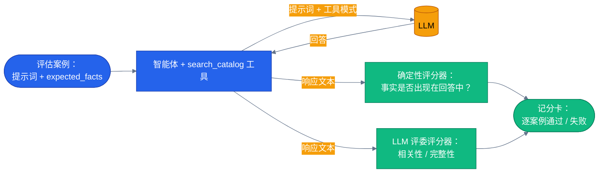

# 第 26 章 · 智能体评估

[项目首页](../../README.md) · [教程总览](../README.md) · [术语表](../_shared/jargon-glossary.md)

把「看起来是对的」变成一个数字：一组测试案例，每个都带一条脚本可检查的事实，自动运行、每次都以同样方式打分。

## 本章动机

此前每一章的结尾都一样：跑脚本、看回答、用眼睛判断它是否像对的。学习某个机制时这没问题，但它不可扩展 —— 「我试了一个提示词，看起来是对的」无法说明你没试过的那些情况，也经受不住一次提示词修改、一次模型升级，或者半年后别人重跑你的代码。本章把「看起来是对的」变成一个数字：一小组测试案例，每个都带一条脚本可检查的事实，自动运行，并且每次都以完全相同的方式打分。

关于「演示为什么不能作为证据」的深入论证 —— 以及一个**看起来**严谨、却测错了对象的评分器的实例 —— 请见 [`docs/concepts/12-evaluation.md`](../../docs/concepts/12-evaluation.md)；本章专注于搭建评估循环本身的机制。

## 前置条件

- 已完成 [第 02 章 · 添加工具](../02-add-tools/)
- 仓库根目录的 `.env` 中有一个可用的 LLM 提供方（`OPENAI_API_KEY`，或 `AZURE_OPENAI_ENDPOINT` + `AZURE_OPENAI_KEY` + `AZURE_OPENAI_DEPLOYMENT`）

## 核心概念

一个好的评估案例是**一个提示词加一条可检查的事实**，而不是一个提示词加一种感觉。「问问无线鼠标，看看回答听起来是否合理」不是评估案例 —— 脚本没有任何可断言的东西。「问问无线鼠标，并检查响应中是否出现 `24.99`」才是：它是一个提示词（`EvalCase.prompt`）配上评分器可以检索的 `expected_facts` 列表。这就是本章 `EVAL_CASES` 列表使用的完整形态，也是真实评估套件所需的形态 —— **一个不可能失败的案例，等于什么都没测**。

有了可检查的案例之后，评分分为两档。**确定性评分** —— 本章 `main.py` 中的 `score_deterministic()` —— 是一次机械的子串检查：预期事实出现了没有。它免费、精确，可以安全地在每次提交时于 CI 中运行，但它只能检查机械可检查的东西；它对周围的文字是否说得通一无所知。**LLM 评委评分**则请第二次模型调用去评判那些没有机械可查答案的东西 —— 回答在实质上是否真的回应了所问的问题。它要花钱，而且对完全相同的输入跑两次结果也无法完美复现，因此只保留给确定性检查够不着的场合，而不是默认对一切都跑。

本仓库自己的评估框架有一段值得点名的、有教益的历史。最初的版本（`evaluator.py` 的 `_run_agent()`）手写了自己的 OpenAI 工具调用循环，直接调用未加装饰器的工具函数，而不是通过 `agent.run()` 运行智能体。那个循环从未走 `agent_host.py` 的真实 MAF 执行路径 —— 没有护栏中间件、没有事实核验，生产应用在每个真实请求上实际运行的那套机制一个都没有。于是评估套件可以报告「全部通过」，而它测试的系统并不是用户正在对话的那个系统。`agents/python/evals/harness.py` 中的 `ProductionRunner`（见下文）正是为堵住这个缺口而存在：它让每个评估案例都走与实时请求相同的分发路径，因此「评估通过」意味着**已部署的系统**通过了，而不是它的一个模拟通过了。


```mermaid
%%{init: {'theme':'base', 'themeVariables': {
  'primaryColor': '#2563eb','primaryTextColor': '#ffffff','primaryBorderColor': '#1e40af',
  'lineColor': '#64748b','secondaryColor': '#f59e0b','tertiaryColor': '#10b981',
  'background': 'transparent'}}}%%
flowchart LR
  classDef core     fill:#2563eb,stroke:#1e40af,color:#ffffff
  classDef external fill:#f59e0b,stroke:#b45309,color:#000000
  classDef success  fill:#10b981,stroke:#047857,color:#ffffff

  case(["评估案例：<br/>提示词 + expected_facts"])
  agent[智能体 + search_catalog 工具]
  llm[(LLM)]
  det["确定性评分器：<br/>事实是否出现在回答中？"]
  judge["LLM 评委评分器：<br/>相关性 / 完整性"]
  card(["记分卡：<br/>逐案例通过 / 失败"])

  case --> agent
  agent -- "提示词 + 工具模式" --> llm
  llm -- "回答" --> agent
  agent -- "响应文本" --> det
  agent -- "响应文本" --> judge
  det --> card
  judge --> card

  class agent core
  class llm external
  class det success
  class judge success
  class card success
```

两个评分器作用于同一份响应 —— 一个便宜且精确，另一个捕捉前者在结构上无法捕捉的东西。

**本章的组件**：

| 组件 | 作用 |
|------|------|
| `EvalCase` | 保存问题与 `expected_facts` |
| `search_catalog` | 查询内存商品的价格与库存 |
| `run_eval_suite` | 逐案例调用智能体并评分 |
| `score_deterministic` | 检查预期字符串是否出现在回答中 |
| `judge_response_stub` | 用启发式生成 `JudgeVerdict` |
| `print_scorecard` | 输出案例分数 |

## Python

在仓库根目录运行，共用 `tutorials/` 这一个 uv 项目（一次 `uv sync` 覆盖全部章节）：

```bash
uv sync --project tutorials
uv run --project tutorials python tutorials/26-evals/python/main.py
```

源码：[`python/main.py`](./python/main.py)。演示智能体是一个作用于五项内存目录的小型电商问答助手，只带一个工具：

```python
@tool(name="search_catalog", description="Look up the price and stock count for a product in the catalog by name.")
def search_catalog(
    product_name: Annotated[str, Field(description="The product name to look up, e.g. 'Wireless Mouse'.")],
) -> str:
    item = CATALOG.get(product_name.strip().lower())
    if item is None:
        return f"No catalog entry for '{product_name}'."
    availability = "in stock" if item["stock"] > 0 else "out of stock"
    return f"{product_name.title()}: ${item['price']:.2f}, {item['stock']} units ({availability})."
```

五条 `EvalCase` 把提示词与回答必须包含的确切事实配对 —— 一个价格、一个库存数，或一句「缺货」。`run_eval_suite()` 逐题询问智能体，然后以两种方式给响应打分：`score_deterministic()` 检查每条预期事实是否作为字面子串出现（忽略大小写）；`judge_response_stub()` 返回结构化的 `JudgeVerdict`（`score`、`reasoning`、`failure_mode`）—— 与真实 `evals/scorers/llm_judge.py::JudgeVerdict` 同形，只是这里用廉价的启发式算出，而不是再发起一次真实 LLM 调用，因为对一个只有五个案例、且使用固定回放 fixture 的教学演示来说，每个案例多花一次模型调用并不值得。**把该函数体换成真实的 `judge.run(...)` 调用，循环里其他任何东西都不用改。** `main()` 运行一次套件并打印记分卡：

```
Case                      Deterministic  Judge   Notes
--------------------------------------------------------------------------------
mouse-price               1.00           1.00    Response covers every expected fact.
keyboard-stock            1.00           1.00    Response covers every expected fact.
hub-out-of-stock          1.00           1.00    Response covers every expected fact.
headphones-price          1.00           1.00    Response covers every expected fact.
charger-price-and-stock   1.00           1.00    Response covers every expected fact.
--------------------------------------------------------------------------------
5/5 cases fully grounded (deterministic score == 1.0)
```

## 常见坑

- **一个不检查它所声称检查之物的评分器，比没有评分器更糟。** `AgentEvaluator._score_groundedness` 的原始版本只要**有**工具被调用就返回 `1.0`，从不把响应的实际文字与工具返回的内容比对 —— 一个编造的价格与一个真实价格得分完全相同。`evals/scorers/db_groundedness.py::score_from_report()` 修正了这一点：它依据真实核验报告计算 `verified_claims / total_claims`，而不是「有工具触发过」。本章的 `score_deterministic()` 是同一思路的微缩版：它检查字面的事实字符串，而不是「调用过工具」。
- **评估证据的成色，取决于它跑在哪条代码路径上。** 让评估案例绕开生产中间件（本仓库自己的评估框架犯过并已修复的错误 —— 见上文「核心概念」），可能让一个红队或安全案例「通过」，却从未真正触发它本该测试的护栏。永远要问：一次评估**实际**跑在哪条代码路径上，而不只是它是否报告绿色。
- **确定性评分需要一条真正可检查的事实。** 本章 `main.py` 的 `EVAL_CASES` 刻意使用精确数字（`"24.99"`、`"15"`）或无歧义短语（`"out of stock"`）作为 `expected_facts` —— 像「提到了鼠标」这种更含糊的目标，即使价格错了也会通过。
- **评委替身不能替代真实评委。** `judge_response_stub()` 被明确标注为启发式替身，以便本章的回放 fixture 集合保持小巧（5 个案例、每个一次 LLM 往返，而不是 10 次）。生产代码应当调用真实的 `evals/scorers/llm_judge.py::judge_response()`，它才真的去问模型。
- **回放 fixture 是按请求、而不是按案例编号的。** 在工具调用参与进来后，每个评估案例可能产生不止一次 LLM 调用（一次是模型决定调用 `search_catalog`，一次是它依据工具结果组织最终回答）—— fixture 文件比评估案例多属正常，不是缺陷。
- **`judge_response_stub` 不是第二个独立评估器。** 不能把两列高度一致的分数当作两个评估器交叉验证 —— 两个总是一致的东西，本质上是一个评分器收了两份钱。

## 测试

```bash
uv run --project tutorials pytest tutorials/26-evals/python/tests -v
```

`python/tests/test_evals.py` 在结构上覆盖：

1. **直接针对 `search_catalog` 与两个评分器的单元测试** —— 预设目录数据、缺货商品、未知商品、大小写不敏感、确定性匹配的满分/部分/零分，以及评委替身的三个覆盖档位 —— 完全不涉及 LLM。
2. **智能体接线** —— `search_catalog` 出现在 `build_agent()` 注册的工具列表中，且每条 `EVAL_CASES` 都确实带有可检查的事实。
3. **回放测试**（`test_replay_runs_full_eval_suite`）—— 回放 `tests/fixtures/replay/` 下已提交的 fixture，无需网络与凭据，可安全用于 CI。
4. **真实 LLM 集成测试** —— 无可用凭据时跳过。一个断言每个评估案例对真实模型都能拿满分，另一个断言无关问题不会泄漏预设目录里的数字。

**测试一个评估框架，意味着给评分器打分** —— 这值得做，恰恰因为一个坏掉的评分器看起来并不像坏的：它照常报数字，数字看起来也合理，套件一路绿灯，而实际上什么都没测到。因此测试直指评分器**说谎的方式**：

- 一个没有预期事实的案例会得 `1.0`（说得过去，但也是陷阱 —— 一整套空案例会报出完美的通过率）
- 确定性档位会放过一个粗鲁、离题的回答，只要数字出现在里面
- `"15"` 会匹配到 `"150"` 里面
- 评委替身**按构造**就与确定性档位一致，而这正是真实评委绝不能做的事

另有两条测试用于保护套件自身：每个案例必须至少有一条可检查事实，且案例 id 必须唯一。

## 在完整项目中的落点

真实的评估框架位于 `agents/python/evals/`。`agents/python/evals/harness.py:92` 的 `ProductionRunner` 类，及其 `agents/python/evals/harness.py:114` 的 `run()` 方法，让每个评估案例都走实时请求所用的同一套分发 —— 编排器走 `orchestrator.modes.get_mode("tool").run(...)`，每个专家走 `shared.agent_host._run_agent_native()` —— 也就是 [第 21 章](../21-capstone-tour/) 导览过的那些生产入口，而不是一份平行模拟。这正是对上述「绕开中间件」错误的正面对治。

本章 `score_deterministic()` 与 `judge_response_stub()` 所对应的两档评分器都是真实模块：`agents/python/evals/scorers/db_groundedness.py:26` 的 `score_from_report()` 是确定性档，它从生产核验中间件在本次运行中已经产出的同一份 `GroundingReport` 计算 `verified_claims / total_claims` —— 免费，不额外访问数据库。`agents/python/evals/scorers/llm_judge.py:57` 的 `judge_response()` 是 LLM 评委档，它把问题、预期字段与响应发给第二个模型，并把结果解析为定义在 `agents/python/evals/scorers/llm_judge.py:41` 的 `JudgeVerdict` Pydantic 模型 —— 本章的替身 `JudgeVerdict` 类复制的正是这个形态。

**售后场景改进所采用的评估设计**：每个案例同时检查 ——

1. 是否选中了正确的订单与工具。
2. 是否遵守了身份、期限与审批条件。
3. 工具失败后是否采取了允许的恢复方式。
4. 数据库最终状态是否符合预期。
5. 重试是否产生了重复的业务效果。
6. 回复是否准确描述了「完成 / 拒绝 / 待澄清 / 待核实」。

先划分开发案例与保留验收案例，再修改提示词、规则与参数。使用相同数据与故障种子比较基线与改进版本，并按故障类别报告结果。

## 下一步

- 推荐接着读：[第 21 章 · 完整项目导览](../21-capstone-tour/)，带你逐一确认每章的模式在真实应用中位于何处
- 概念深入：[`docs/concepts/12-evaluation.md`](../../docs/concepts/12-evaluation.md)
- 完整源码：[`python/`](./python/)
- 共享材料：[Mermaid 风格指南](../_shared/mermaid-style-guide.md) · [术语表](../_shared/jargon-glossary.md)

**本章验收标准**：能够设计一个会**真正失败**的案例，指出评分器可能漏掉什么；能够区分「正确拒绝」与「成功执行」；能够解释为什么一次最好结果不足以代表稳定性能。
