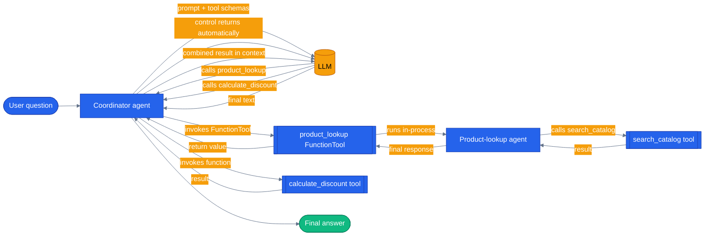

# Chapter 27 — Agent-as-tool

## Why this chapter

Every multi-agent pattern so far in this series either crosses a process boundary (this repo's
default `tool` orchestration mode, where the orchestrator's LLM calls `call_specialist_agent`,
which is an A2A HTTP call dressed up as a tool call) or hands control away entirely (Chapter 14's
`HandoffBuilder` mesh, where the receiving agent takes the floor and decides for itself when to
hand back). Neither is the right shape for the common case of "this agent needs another agent's
capability as a single well-defined step, in the same process, and then wants to keep going."

MAF v1 has a third option for exactly that case: `Agent.as_tool(...)`. It wraps any `Agent` object
as an ordinary `FunctionTool` — the same shape as any `@tool`-decorated function — that another
agent can add to its own `tools=[...]`. No network hop, no mesh topology, no handoff bookkeeping.
Control returns to the caller automatically the instant the wrapped agent finishes, exactly like
any other tool call. This chapter builds a small "coordinator" agent that calls a small
"product-lookup" agent this way, and makes the automatic-return-of-control visible: the
coordinator gets the looked-up product back, then keeps going and calls a second, ordinary tool
to compute a discount — something a sub-agent that had "taken the floor" via handoff could not be
made to do for it.

## The concept

Three patterns in this codebase all look like "one agent uses another," and it's easy to conflate
them once you've read [`docs/concepts/06-orchestration-patterns.md`](../../docs/concepts/06-orchestration-patterns.md),
which documents two of the three but doesn't name the third. Laid out side by side:

- **A2A-as-tool** (this repo's real `tool` orchestration mode) — cross-process. The orchestrator's
  LLM calls `call_specialist_agent`, which does an HTTP POST to a specialist's `/message:send` or
  `/message:stream` endpoint (`agents/python/orchestrator/agent.py:40`). The callee is a separate
  running service with its own port, its own process, its own failure modes (timeouts, connection
  refused). It only *looks* like a tool call from the LLM's point of view; underneath it's a
  network request.
- **`Agent.as_tool()`** (this chapter) — in-process. `agent.as_tool(...)` wraps an already-built
  `Agent` object into a `FunctionTool`; no socket is opened, no serialization crosses a process
  boundary. The wrapped agent runs in the same Python process, in the same `await`, as the caller.
  Control returns to the caller automatically once the wrapped agent produces its final response —
  same as any tool call returning a value.
- **Handoff** (`HandoffBuilder`, Chapter 14) — control *transfers*. The target agent doesn't just
  answer and hand a return value back; it takes over the conversation and can itself decide to
  hand back, hand off again, or just keep talking. The caller doesn't automatically get control
  back the way it does with a tool call.

The problem `Agent.as_tool()` solves is composition without the overhead of the other two: you get
a small, well-scoped agent (its own instructions, its own tools, its own reasoning) usable as a
single callable capability inside a bigger agent's toolset — no HTTP client, no mesh of
`add_handoff(...)` edges to maintain, no risk of an unbounded back-and-forth. Reach for it when
the composition is in-process, same deployment, and the relationship between the two agents is
"call it, get an answer, move on" — a single well-defined step, not a multi-turn conversation
between them. Reach for A2A instead when the callee is a genuinely separate service (different
deployment, different scaling, different team). Reach for handoff instead when the interaction
needs more than one round trip between the two agents, or when the receiving agent should be free
to keep driving the conversation rather than just answering and yielding back.



The wrapped agent never "keeps" the conversation — once `product_lookup` returns its string, the
coordinator is back in the driver's seat and free to call a second, unrelated tool before
answering.

## Python

Run from the repo root using the shared `tutorials/` uv project (one `uv sync` covers every
chapter):

```bash
uv sync --project tutorials
uv run --project tutorials python tutorials/27-agent-as-tool/python/main.py
```

Source: [`python/main.py`](./python/main.py). The product-lookup agent is an ordinary `Agent`
with one ordinary tool:

```python
@tool(name="search_catalog", description="Look up a product in the catalog by name.")
def search_catalog(
    name: Annotated[str, Field(description="The product name to look up, e.g. 'Wireless Headphones'.")],
) -> str:
    item = CATALOG.get(name.lower().strip())
    if item is None:
        return f"No catalog entry for '{name}'."
    return (
        f"{name.title()}: ${item['price']:.2f}, category {item['category']}, "
        f"{item['stock']} in stock."
    )


def build_product_lookup_agent(client: object | None = None) -> Agent:
    return Agent(
        client or _default_client(),
        instructions=PRODUCT_LOOKUP_INSTRUCTIONS,
        name="product-lookup-agent",
        description="Looks up product price, category, and stock in the catalog.",
        tools=[search_catalog],
    )
```

`build_agent()` is the entire point of this chapter — wrap that agent with `.as_tool()` and hand
the resulting `FunctionTool` to the coordinator's own `tools=[...]`, next to an ordinary local
tool:

```python
def build_agent(client: object | None = None) -> Agent:
    resolved_client = client or _default_client()
    product_lookup_agent = build_product_lookup_agent(resolved_client)
    product_lookup_tool = product_lookup_agent.as_tool(
        name="product_lookup",
        description="Delegate a product question to the product-lookup specialist agent.",
        arg_name="task",
    )
    return Agent(
        resolved_client,
        instructions=COORDINATOR_INSTRUCTIONS,
        name="coordinator-agent",
        tools=[product_lookup_tool, calculate_discount],
    )
```

Run it with the default question — `"Look up the Wireless Headphones, then tell me the price
after a 20% discount."` — and the coordinator calls `product_lookup`, gets back
`"Wireless Headphones: $149.99, category Electronics, 42 in stock."`, and then — still in
control, on its own next turn — calls `calculate_discount(149.99, 20)` and folds both results into
one answer: `"The Wireless Headphones are priced at $149.99. After applying a 20% discount, the
price comes to $119.99."` Nothing about the coordinator's follow-up decision required the
product-lookup agent to "hand back" anything — it never had control to begin with.

## .NET

Source: [`dotnet/Program.cs`](./dotnet/Program.cs).

```bash
cd tutorials/27-agent-as-tool/dotnet
dotnet run
dotnet test tests/AgentAsTool.Tests.csproj
```

`AIAgentExtensions.AsAIFunction(...)` is the .NET counterpart to Python's `Agent.as_tool(...)`:

```csharp
AIFunction productLookupTool = productLookup.AsAIFunction(new AIFunctionFactoryOptions
{
    Name = "product_lookup",
    Description = "Delegate a product question to the product-lookup specialist agent.",
});
```

The coordinator sees an `AIFunction` like any other and has no idea there is an agent — and a second model call — behind it.

Set this against [Chapter 14](../14-handoff-orchestration/): a handoff **transfers control**, so the specialist answers the user directly. A wrapped agent **keeps control**, so the coordinator gets a string back and carries on, free to call other tools and compose the results. The user never learns a second agent existed.

`The_Wrapped_Agents_Own_Tools_Are_Not_Exposed_To_The_Coordinator` is the assertion that matters: if `search_catalog` leaked upward, the coordinator could bypass the specialist entirely — and would, eventually, on some prompt nobody tested.

Both agents share one chat client, so the demo needs one provider and one credential. That also means the specialist's turns are billed to the same budget: agent-as-tool is not free, it just hides the second agent from the user rather than from the invoice.

## Gotchas

- **`.as_tool()` returns a `FunctionTool`, not a live handle to the agent.** Calling it doesn't
  start a conversation you can keep talking to — every invocation runs the wrapped agent fresh
  (or, with `propagate_session=True`, forwards the caller's session) and returns a single string.
  If you need the two agents to go back and forth more than once per turn, this is the wrong tool
  — reach for `HandoffBuilder` (Chapter 14) instead.
- **Zero usages in this repo's production app today.** `agents/python/orchestrator/agent.py` and
  every specialist agent were grepped for `as_tool(` / `AsAIFunction` and neither appears anywhere
  under `agents/`, `orchestrator/`, `web/`, or `docs/` outside this chapter. The capstone's `tool`
  orchestration mode composes agents over A2A HTTP instead (see "How this shows up in the
  capstone" below) — `Agent.as_tool()` is a real, documented MAF capability this codebase simply
  hasn't reached for yet, not a pattern retrofitted from existing code.
- **The wrapped agent's `arg_name` default is `"task"`, not `"input"` or `"query"`.** The LLM
  calling the wrapper sees a single string argument named whatever `arg_name` says (`"task"` by
  default) with an auto-generated description (`f"Task for {tool_name}"`) unless you override
  `arg_description` — a vague default description makes the calling LLM more likely to pass a
  malformed or underspecified task string.
- **`propagate_session=False` by default.** The wrapped agent gets an independent session per
  call unless you explicitly opt into sharing the parent's session — usually what you want for a
  narrow, single-purpose lookup like `product_lookup` here, since it shouldn't accumulate
  unrelated conversation history across calls.
- **Descriptions on both the wrapped agent and the tool matter.** The LLM deciding whether to call
  `product_lookup` only sees `name` + `description` + the `task` argument's schema — it never sees
  the wrapped agent's own `instructions`. If the tool-level `description` is vague, the coordinator
  may under- or over-use it exactly like any other under-described tool (see Chapter 02's Gotchas).

## Tests

```bash
uv run --project tutorials pytest tutorials/27-agent-as-tool/python/tests -v
```

`tutorials/27-agent-as-tool/python/tests/test_agent_as_tool.py` covers, structurally:

1. **Unit tests against the tool functions directly** — `search_catalog` and `calculate_discount`,
   no LLM involved.
2. **Agent-wiring tests** — the coordinator's registered tools include both `product_lookup` (the
   wrapped agent) and `calculate_discount`; the product-lookup agent's registered tools include
   `search_catalog`; and `.as_tool()` genuinely returns a `FunctionTool`, not the raw agent.
3. **A replay test** (`test_replay_coordinator_combines_lookup_and_discount`) that plays back
   committed fixtures in `tests/fixtures/replay/` — no network or credentials required, safe for
   CI.
4. **Real-LLM integration tests**, skipped unless usable credentials are present — one asserts the
   coordinator keeps control after the wrapped agent answers and goes on to call
   `calculate_discount` itself; the other asserts a lookup-only question still resolves correctly
   through the wrapped agent alone.

## How this shows up in the capstone

Honestly: it doesn't, yet. `Agent.as_tool()` has zero call sites in `agents/`, `orchestrator/`,
or `web/` as of this chapter — the capstone's default `tool` orchestration mode solves the "one
agent uses another" problem with A2A over HTTP instead, since its specialists are genuinely
separate deployments, not in-process objects. `agents/python/orchestrator/agent.py:40` is
`call_specialist_agent`, the real contrast case:

```python
async def call_specialist_agent(
    agent_name: Annotated[str, Field(description="Name of the specialist agent to call")],
    message: Annotated[str, Field(description="The message/request to send to the specialist agent")],
) -> str:
    """Call a specialist agent and return its response."""
    url = AGENT_REGISTRY.get(agent_name)
```

It has the same *shape* from the LLM's point of view as this chapter's `product_lookup` tool — a
single string argument, a single string result — but everything past `url = AGENT_REGISTRY.get(...)`
is an `httpx` call to another process's `/message:send` or `/message:stream` endpoint
(`agents/python/orchestrator/agent.py:66-90`), not an in-process `agent.run()`. That's the whole
distinction this chapter teaches, visible in one real file: same tool-shaped interface, completely
different implementation underneath, because the capstone's specialists are separate services and
this chapter's product-lookup agent isn't.

## What's next

- Related: [Chapter 14 — Handoff Orchestration](../14-handoff-orchestration/) for when control
  should actually transfer instead of returning automatically.
- Concepts: [Orchestration patterns](../../docs/concepts/06-orchestration-patterns.md)
- Full source: [`python/`](./python/)
- Shared: [Mermaid style guide](../_shared/mermaid-style-guide.md) · [Jargon glossary](../_shared/jargon-glossary.md)
