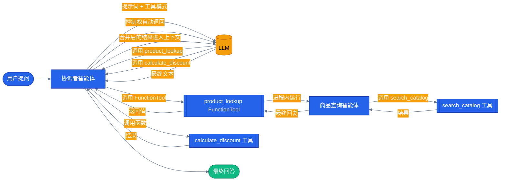

# 第 27 章 · 把智能体作为工具

[项目首页](../../README.md) · [教程总览](../README.md) · [术语表](../_shared/jargon-glossary.md)

## 本章动机

本系列此前的每一种多智能体模式，要么跨越进程边界（本仓库默认的 `tool` 编排模式：编排器的 LLM 调用 `call_specialist_agent`，而那是一次披着工具调用外衣的 A2A HTTP 调用），要么把控制权整体交出去（第 14 章的 `HandoffBuilder` 网：接收方智能体接管发言权，并自行决定何时交还）。对于「这个智能体需要另一个智能体的能力，作为同一个进程内的一个定义良好的步骤，然后还要继续往下走」这种常见情形，两者都不是合适的形态。

针对这种情形，MAF v1 提供了第三种选择：`Agent.as_tool(...)`。它把任意 `Agent` 对象包装成一个普通的 `FunctionTool` —— 与任何 `@tool` 装饰的函数同形 —— 供另一个智能体加进自己的 `tools=[...]`。没有网络跳转，没有网状拓扑，没有交接记账。被包装的智能体一完成，控制权就自动回到调用方，与任何其他工具调用完全一样。本章构建一个小型「协调者」智能体，用这种方式调用一个小型「商品查询」智能体，并让「控制权自动返回」这件事变得可见：协调者拿回查到的商品后继续往下走，再调用第二个普通工具来计算折扣 —— 而一个通过交接「接管了发言权」的子智能体是无法被要求替它做这件事的。

## 核心概念

本代码库里有三种模式都看起来像「一个智能体使用另一个智能体」，而读完 [`docs/concepts/06-orchestration-patterns.md`](../../docs/concepts/06-orchestration-patterns.md) 之后很容易把它们混为一谈 —— 那份文档记录了其中两种，却没有为第三种命名。并列摆开看：

- **A2A 即工具**（本仓库真实的 `tool` 编排模式）—— 跨进程。编排器的 LLM 调用 `call_specialist_agent`，后者向专业智能体的 `/message:send` 或 `/message:stream` 端点发起一次 HTTP POST（`agents/python/orchestrator/agent.py:55`）。被调方是一个独立运行的服务，有自己的端口、自己的进程、自己的失败模式（超时、连接被拒）。它只是*从 LLM 的视角看*像一次工具调用；底层是一次网络请求。
- **`Agent.as_tool()`**（本章）—— 进程内。`agent.as_tool(...)` 把一个已经构建好的 `Agent` 对象包装成 `FunctionTool`；不打开套接字，没有跨进程边界的序列化。被包装的智能体与调用方跑在同一个 Python 进程、同一个 `await` 中。一旦被包装的智能体产出最终回复，控制权就自动回到调用方 —— 与任何返回值的工具调用相同。
- **处理权交接**（`HandoffBuilder`，第 14 章）—— 控制权*转移*。目标智能体不只是回答并把返回值交回；它接管对话，并且自己可以决定交还、再次交接，或者继续说话。调用方不会像工具调用那样自动拿回控制权。

`Agent.as_tool()` 解决的是「组合，但不承担另两种的开销」这个问题：你得到一个范围清晰的小智能体（自己的指令、自己的工具、自己的推理），它可以作为单个可调用的能力用在更大智能体的工具集中 —— 不需要 HTTP 客户端，不需要维护一张 `add_handoff(...)` 边构成的网，也没有无限来回的风险。当组合发生在进程内、同一次部署中，且两个智能体之间的关系是「调用它、拿到答案、继续」时 —— 一个定义良好的单步，而不是它们之间的多轮对话 —— 就用它。当被调方是真正独立的服务（不同部署、不同扩缩容、不同团队）时，改用 A2A。当两个智能体之间需要多于一次的往返，或者接收方智能体应当自由地继续驱动对话而不只是回答并让出时，改用处理权交接。


```mermaid
%%{init: {'theme':'base', 'themeVariables': {
  'primaryColor': '#2563eb','primaryTextColor': '#ffffff','primaryBorderColor': '#1e40af',
  'lineColor': '#64748b','secondaryColor': '#f59e0b','tertiaryColor': '#10b981',
  'background': 'transparent'}}}%%
flowchart LR
  classDef core     fill:#2563eb,stroke:#1e40af,color:#ffffff
  classDef external fill:#f59e0b,stroke:#b45309,color:#000000
  classDef success  fill:#10b981,stroke:#047857,color:#ffffff

  user([用户提问])
  coord[协调者智能体]
  llm[(LLM)]
  lookupTool[[product_lookup FunctionTool]]
  lookupAgent[商品查询智能体]
  catalogTool[[search_catalog 工具]]
  discountTool[[calculate_discount 工具]]
  answer([最终回答])

  user --> coord
  coord -- "提示词 + 工具模式" --> llm
  llm -- "调用 product_lookup" --> coord
  coord -- "调用 FunctionTool" --> lookupTool
  lookupTool -- "进程内运行" --> lookupAgent
  lookupAgent -- "调用 search_catalog" --> catalogTool
  catalogTool -- "结果" --> lookupAgent
  lookupAgent -- "最终回复" --> lookupTool
  lookupTool -- "返回值" --> coord
  coord -- "控制权自动返回" --> llm
  llm -- "调用 calculate_discount" --> coord
  coord -- "调用函数" --> discountTool
  discountTool -- "结果" --> coord
  coord -- "合并后的结果进入上下文" --> llm
  llm -- "最终文本" --> coord
  coord --> answer

  class coord core
  class lookupAgent core
  class llm external
  class lookupTool core
  class catalogTool core
  class discountTool core
  class answer success
```

被包装的智能体从不「占用」对话 —— 一旦 `product_lookup` 返回它的字符串，协调者就回到了驾驶座，可以自由地在回答之前调用第二个互不相关的工具。

## Python

在仓库根目录运行，使用共享的 `tutorials/` uv 项目（一次 `uv sync` 覆盖全部章节）：

```bash
uv sync --project tutorials
uv run --project tutorials python tutorials/27-agent-as-tool/python/main.py
```

源码：[`python/main.py`](./python/main.py)。商品查询智能体就是一个普通的 `Agent`，带一个普通的工具：

```python
@tool(name="search_catalog", description="Look up a product in the catalog by name.")
def search_catalog(
    name: Annotated[str, Field(description="The product name to look up, e.g. 'Wireless Headphones'.")],
) -> str:
    item = CATALOG.get(name.lower().strip())
    if item is None:
        return f"No catalog entry for '{name}'."
    return (
        f"{name.title()}: ${item['price']:.2f}, category {item['category']}, "
        f"{item['stock']} in stock."
    )


def build_product_lookup_agent(client: object | None = None) -> Agent:
    return Agent(
        client or _default_client(),
        instructions=PRODUCT_LOOKUP_INSTRUCTIONS,
        name="product-lookup-agent",
        description="Looks up product price, category, and stock in the catalog.",
        tools=[search_catalog],
    )
```

`build_agent()` 才是本章的全部要点 —— 用 `.as_tool()` 包装那个智能体，并把得到的 `FunctionTool` 交给协调者自己的 `tools=[...]`，与一个普通本地工具并列：

```python
def build_agent(client: object | None = None) -> Agent:
    resolved_client = client or _default_client()
    product_lookup_agent = build_product_lookup_agent(resolved_client)
    product_lookup_tool = product_lookup_agent.as_tool(
        name="product_lookup",
        description="Delegate a product question to the product-lookup specialist agent.",
        arg_name="task",
    )
    return Agent(
        resolved_client,
        instructions=COORDINATOR_INSTRUCTIONS,
        name="coordinator-agent",
        tools=[product_lookup_tool, calculate_discount],
    )
```

用默认问题运行它 —— `"Look up the Wireless Headphones, then tell me the price after a 20% discount."` —— 协调者会调用 `product_lookup`，拿回 `"Wireless Headphones: $149.99, category Electronics, 42 in stock."`，然后 —— 仍然握有控制权，在自己的下一轮里 —— 调用 `calculate_discount(149.99, 20)`，并把两个结果揉成一个回答：`"The Wireless Headphones are priced at $149.99. After applying a 20% discount, the price comes to $119.99."` 协调者后续这一决定，完全不需要商品查询智能体「交还」任何东西 —— 它从一开始就不曾拥有控制权。

把它与[第 14 章](../14-handoff-orchestration/)对照：处理权交接**转移控制权**，因此专业智能体直接回答用户。被包装的智能体**保留控制权在调用方**，因此协调者拿到一个字符串后继续前进，可以自由调用其他工具并组合结果。用户永远不会知道曾存在第二个智能体。

## 常见坑

- **`.as_tool()` 返回的是 `FunctionTool`，而不是指向该智能体的活句柄。** 调用它并不会开启一段你可以继续对话的会话 —— 每次调用都全新地运行被包装的智能体（或者，在 `propagate_session=True` 时转发调用方的会话），并返回单个字符串。如果你需要两个智能体在每个轮次里来回多于一次，那这个工具就用错了 —— 请改用 `HandoffBuilder`（第 14 章）。
- **目前本仓库的生产应用里零处使用。** 曾对 `agents/python/orchestrator/agent.py` 以及每一个专业智能体搜索过 `as_tool(`，在本章之外 `agents/`、`orchestrator/`、`web/`、`docs/` 下都没有出现。完整项目的 `tool` 编排模式改用 A2A over HTTP 来组合智能体（见下文「在完整项目中的落点」）—— `Agent.as_tool()` 是一项真实且有文档的 MAF 能力，只是本代码库尚未用到，而不是从既有代码里改造出来的模式。
- **被包装智能体的 `arg_name` 默认是 `"task"`，不是 `"input"` 或 `"query"`。** 调用该包装的 LLM 看到的是一个字符串参数，名字取决于 `arg_name` 的取值（默认 `"task"`），描述则是自动生成的（`f"Task for {tool_name}"`），除非你覆盖 `arg_description` —— 一个含糊的默认描述会让调用的 LLM 更容易传入格式错误或说明不足的任务字符串。
- **默认 `propagate_session=False`。** 除非显式选择共享父级会话，被包装的智能体每次调用都会得到一个独立会话 —— 对于像这里的 `product_lookup` 这种窄用途查询，这通常正是你想要的，因为它不应在多次调用之间累积无关的对话历史。
- **被包装智能体的描述与工具的描述都重要。** 决定是否调用 `product_lookup` 的 LLM 只能看到 `name` + `description` + `task` 参数的 schema —— 它永远看不到被包装智能体自己的 `instructions`。如果工具层面的 `description` 含糊，协调者就可能像对待任何其他描述不足的工具那样少用或多用它（参见第 02 章的常见坑）。
- **两个智能体共用一个 chat client，因此计费也落在同一份预算上。** 演示只需要一个提供方和一份凭据；代价是被包装智能体的轮次与调用方一起计费 —— 把智能体作为工具并不是免费的，它只是把第二个智能体对*用户*隐藏起来，而不是对*账单*隐藏起来。

## 测试

```bash
uv run --project tutorials pytest tutorials/27-agent-as-tool/python/tests -v
```

`tutorials/27-agent-as-tool/python/tests/test_agent_as_tool.py` 从结构上覆盖：

1. **直接针对工具函数的单元测试** —— `search_catalog` 与 `calculate_discount`，不涉及 LLM。
2. **智能体接线测试** —— 协调者注册的工具同时包含 `product_lookup`（被包装的智能体）与 `calculate_discount`；商品查询智能体注册的工具包含 `search_catalog`；以及 `.as_tool()` 确实返回 `FunctionTool` 而非原始智能体。
3. **一次回放测试**（`test_replay_coordinator_combines_lookup_and_discount`），播放 `tests/fixtures/replay/` 中已提交的夹具 —— 不需要网络或凭据，可安全用于 CI。
4. **真实 LLM 集成测试**，在缺少可用凭据时跳过 —— 一个断言协调者在被包装智能体回答之后仍握有控制权，并自行继续调用 `calculate_discount`；另一个断言一个只需查询的问题仅经由被包装的智能体也能正确解答。

其中最关键的一条断言是「被包装智能体自己的工具不会暴露给协调者」：如果 `search_catalog` 向上泄漏了，协调者就能完全绕过专业智能体 —— 而且迟早会在某个没人测过的提示词上真的绕过它。

## 在完整项目中的落点

坦白说：目前还没有。截至本章，`Agent.as_tool()` 在 `agents/`、`orchestrator/`、`web/` 中零调用点 —— 完整项目默认的 `tool` 编排模式改用 A2A over HTTP 解决「一个智能体使用另一个智能体」的问题，因为它的专业智能体是真正独立的部署，而不是进程内对象。`agents/python/orchestrator/agent.py:55` 的 `call_specialist_agent` 就是真实的反例：

```python
async def call_specialist_agent(
    agent_name: Annotated[str, Field(description="Name of the specialist agent to call")],
    message: Annotated[str, Field(description="The message/request to send to the specialist agent")],
) -> str:
    """Call a specialist agent and return its response."""
    url = AGENT_REGISTRY.get(agent_name)
```

从 LLM 的视角看，它与本章的 `product_lookup` 工具*形态*相同 —— 一个字符串参数、一个字符串结果 —— 但 `url = AGENT_REGISTRY.get(...)`（`agents/python/orchestrator/agent.py:60`）之后的一切，都是对另一个进程的 `/message:send` 或 `/message:stream` 端点发起的 `httpx` 调用（`agents/python/orchestrator/agent.py:89-163`），而不是进程内的 `agent.run()`。这正是本章讲授的全部区别，且在一个真实文件中可见：工具形状的接口相同，底下的实现完全不同 —— 因为完整项目的专业智能体是独立服务，而本章的商品查询智能体不是。

## 下一步

- 相关：[第 14 章 · 移交式编排](../14-handoff-orchestration/)，讲控制权应当真正转移、而不是自动返回的场景。
- 概念：[编排模式](../../docs/concepts/06-orchestration-patterns.md)
- 完整源码：[`python/`](./python/)
- 共享资料：[Mermaid 风格指南](../_shared/mermaid-style-guide.md) · [术语表](../_shared/jargon-glossary.md)
