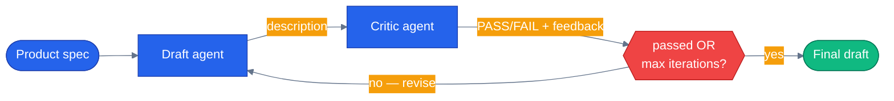

# Chapter 28 — Reflection and Critique

## Why this chapter

Every earlier chapter treats the model's first answer as the answer. Chapter 24 added a
verification step, but it only *checks* the answer after the fact — it never gives the model a
second try. Some outputs genuinely benefit from a second try: a product description that has to
mention the price, name a feature, and stay under a word limit is exactly the kind of thing a
model gets partially right on the first attempt and fully right on the second, once it's told
specifically what it missed. This chapter builds that second try as a real loop — draft, have a
critic score it against named criteria, revise using the critic's specific feedback, score again —
capped at a hard maximum so "try again" can never become "try forever." It is also the first
chapter in this series where the code in this repo, not the framework, drives a multi-turn loop
with no built-in bound. MAF bounds its own tool-calling loop for you (Chapter 02); nothing bounds
this one except the constant this chapter writes by hand.

## Prerequisites

- Completed [Chapter 02 — Adding Tools](../02-add-tools/) (the request/response shape a single
  agent call produces)
- Completed [Chapter 24 — RAG and Grounding](../24-rag-and-grounding/) (a post-generation
  verification step that doesn't feed back into another generation — this chapter is what happens
  when you close that loop)
- Repo-root `.env` with a working LLM provider (`OPENAI_API_KEY`, or `AZURE_OPENAI_ENDPOINT` +
  `AZURE_OPENAI_KEY` + `AZURE_OPENAI_DEPLOYMENT`)

## The concept

Reflection (also called a critic loop, or self-refine) is three roles wired into a cycle:

1. **Draft** — an agent produces a first attempt at the output.
2. **Critique** — a second pass — the same agent with different instructions, or, as here, a
   distinct critic agent — scores the draft against explicit, named criteria and returns specific
   feedback, not just a thumbs up/down.
3. **Revise** — if the critique fails, the draft agent gets another turn, this time with the
   critic's feedback folded directly into the prompt, and the cycle repeats.

The loop terminates one of two ways: the critique passes, or a hard `MAX_ITERATIONS` cap is
reached. That cap is not an optimization — it is the thing that makes this pattern safe to ship.
Every other loop in this series has a framework-enforced bound: Chapter 02's tool-calling loop
stops the moment the model stops requesting tools, and the two MAF workflow modes in the capstone
(`workflows/pre_purchase.py`, `workflows/return_replace.py`) are directed acyclic graphs — a
message flows from one executor to the next and the workflow finishes, never revisiting a node.
Neither of those bounds applies to a critic loop, because a critic loop's whole point is
revisiting the same step. A critic that never says "pass" — a rubric that's subtly unsatisfiable,
a model that keeps making the same mistake, a genuinely impossible constraint — will keep the loop
running for as long as you let it, burning one draft call and one critic call per turn. This
repo's own architecture has no answer to that risk anywhere else, because no other workflow in
this repo has a cycle at all; `MAX_ITERATIONS` in this chapter's `main.py` is where that risk first
shows up, and a hard-coded integer is the entire mitigation.

Reflection earns its cost when the output has checkable, specific quality criteria and getting
them right matters more than answering fast: a product description with a price and word-count
rule, a support reply that must not promise a refund, a summary that must cite a source. It's
wasted effort for a quick conversational reply with no checkable criteria at all — there's nothing
for a critic to grade, and you'd be paying for a second (and third) LLM call to rubber-stamp
something a single call already got right.



The cycle back into `draft` is the whole chapter. `pass_check` is the only thing that ever breaks
out of it — and it breaks out on *two* conditions, not one: the critic passing the draft, or
`MAX_ITERATIONS` being reached regardless of the verdict.

## Python

Run from the repo root using the shared `tutorials/` uv project (one `uv sync` covers every
chapter):

```bash
uv sync --project tutorials
uv run --project tutorials python tutorials/28-reflection-and-critique/python/main.py
```

Source: [`python/main.py`](./python/main.py). Two agents, one instructions string each — the draft
agent writes, the critic agent grades against three named criteria in a fixed, parseable format:

```python
CRITIC_INSTRUCTIONS = (
    "You are a strict copy editor grading a product description against three named criteria: "
    "PRICE (does it mention the exact price given), FEATURE (does it mention at least one of "
    "the listed features), LENGTH (is it at or under the given word limit). "
    "Respond in EXACTLY this format, one line per criterion, nothing before or after it:\n"
    "PRICE: PASS or FAIL\n"
    "FEATURE: PASS or FAIL\n"
    "LENGTH: PASS or FAIL\n"
    "FEEDBACK: one sentence covering every FAIL, or 'none' if all three pass\n"
    "Grade exactly what the text says — do not soften a FAIL into a PASS to be polite."
)
```

`parse_critique()` turns that fixed-format text into a `CritiqueResult` the loop can branch on —
and treats any criterion the critic *doesn't* clearly mark `PASS` as a `FAIL`, not a free pass:

```python
def parse_critique(text: str) -> CritiqueResult:
    verdicts = {m.group(1).upper(): m.group(2).upper() == "PASS" for m in _CRITERION_RE.finditer(text)}
    feedback_match = _FEEDBACK_RE.search(text)
    feedback = feedback_match.group(1).strip() if feedback_match else ""
    return CritiqueResult(
        price_ok=verdicts.get("PRICE", False),
        feature_ok=verdicts.get("FEATURE", False),
        length_ok=verdicts.get("LENGTH", False),
        feedback=feedback,
    )
```

The loop itself — draft once, then critique/revise up to `max_iterations` times, stopping the
instant a critique passes:

```python
async def run_reflection_loop(
    draft_agent: Agent, critic_agent: Agent, product: Product, *, max_iterations: int = MAX_ITERATIONS
) -> list[Iteration]:
    iterations: list[Iteration] = []
    draft = await ask(draft_agent, draft_prompt(product))
    for number in range(1, max_iterations + 1):
        critique_text = await ask(critic_agent, critic_prompt(product, draft))
        critique = parse_critique(critique_text)
        iterations.append(Iteration(number=number, draft=draft, critique=critique))
        if critique.passed or number == max_iterations:
            break
        draft = await ask(draft_agent, revise_prompt(product, draft, critique))
    return iterations
```

`main()` prints every iteration's draft, the critic's per-criterion verdict, and the feedback that
fed the next revision — the loop is visible in the output, not just the final result:

```
Product: Aurora Desk Lamp ($39.99)
Criteria: mentions price, mentions a feature, <= 40 words

--- Iteration 1/3 ---
Draft: Illuminate your workspace with the Aurora Desk Lamp—featuring adjustable color
temperature, touch dimmer, and a convenient USB-C charging port. Perfect for any desk
setup, it combines stylish design with modern functionality, all for just $39.99.
Critic: PRICE=PASS FEATURE=PASS LENGTH=PASS
Result: PASS

Passed after 1 iteration(s). Final description:
Illuminate your workspace with the Aurora Desk Lamp—featuring adjustable color
temperature, touch dimmer, and a convenient USB-C charging port. Perfect for any desk
setup, it combines stylish design with modern functionality, all for just $39.99.
```

A stricter word limit or a product with no listed features reliably produces a `FAIL` on the first
iteration and a visible revision on the second — the loop only prints one iteration in the example
above because `gpt-4.1` gets this particular rubric right on the first try most of the time.

## .NET

Source: [`dotnet/Program.cs`](./dotnet/Program.cs).

```bash
cd tutorials/28-reflection-and-critique/dotnet
dotnet run
dotnet test tests/Reflection.Tests.csproj
```

Same loop, same hard cap, same parsing posture — any criterion the critic does not clearly mark `PASS` is treated as `FAIL`:

```csharp
return new CritiqueResult(
    PriceOk: verdicts.GetValueOrDefault("PRICE"),
    FeatureOk: verdicts.GetValueOrDefault("FEATURE"),
    LengthOk: verdicts.GetValueOrDefault("LENGTH"),
    Feedback: feedback.Success ? feedback.Groups[1].Value.Trim() : string.Empty);
```

That default has a real cost — a critic whose output drifts causes extra revisions — and the alternative is much worse: a parser defaulting to `PASS` turns an unreadable critique into a silent approval, and the loop stops enforcing anything while still looking like it works.

The tests are shaped around the two ways an unbounded loop goes wrong: it never stops, or it stops for the wrong reason. One is an off-by-one worth calling out — `Hitting_The_Cap_Does_Not_Spend_A_Revision_Nobody_Grades` asserts exactly six calls for a three-iteration run (1 draft + 3 critiques + 2 revisions). A seventh revision after the final critique is invisible in the output and shows up only on the invoice.

## Gotchas

- **The `MAX_ITERATIONS` cap is load-bearing, not decorative.** A critic loop has no
  framework-enforced stopping condition the way Chapter 02's tool-calling loop does. Remove the
  cap, or set it too high, and a critic that never says `PASS` — a genuinely unsatisfiable rubric,
  a flaky model, criteria that contradict each other — spins forever, one draft call and one critic
  call per turn, an unbounded token bill for an unbounded amount of time. `test_run_reflection_loop_
  respects_max_iterations_cap` in the test suite exists specifically to prove the loop stops even
  when the critic never passes.
- **A missing criterion in the critic's response is a FAIL, not a PASS.** `parse_critique()`
  defaults every criterion to `False` unless the critic's text explicitly marks it `PASS`. Defaulting
  the other way — treating "the critic didn't mention LENGTH" as "LENGTH must be fine" — would let a
  critic that garbles its own output format silently rubber-stamp a bad draft.
  `test_parse_critique_treats_missing_criterion_as_fail` covers this.
  `test_parse_critique_handles_completely_unparseable_text` covers the critic ignoring the format
  entirely — the loop still fails safe and revises (or hits the cap) rather than crashing.
  Real critic instructions are always one bad model turn away from an unparseable response.
- **Two agents, two separate instructions, but one shared parsing contract.** `build_draft_agent()`
  and `build_critic_agent()` are independent `Agent` objects — nothing links them except the loop
  in `run_reflection_loop()` calling one, then the other, then feeding one's output into the
  other's next prompt. There's no MAF primitive for "critic agent"; this is two ordinary agents and
  a Python `for` loop.
  You can just as easily do this with one agent and two different instruction strings passed per
  call instead of a second agent object — the loop-and-cap mechanics are identical either way.
- **Revision quality depends entirely on specific feedback, not a bare verdict.** `revise_prompt()`
  folds `critique.feedback` — the critic's one-sentence explanation — directly into the next draft
  prompt. A critic that only ever returns `FAIL` with no explanation gives the draft agent nothing
  to act on, and the loop just regenerates a similar draft each time until it hits the cap. The
  feedback line in `CRITIC_INSTRUCTIONS` is not optional decoration.
- **This is deliberately not a new orchestrator mode.** The production app's mode registry
  (`orchestrator/modes/`) has five live modes, each with its own SSE/UI/test surface — adding a
  sixth "reflection" mode per tutorial chapter would be disproportionate to what this chapter
  teaches. This is standalone tutorial code; nothing under `agents/python/orchestrator/` or
  `agents/python/workflows/` changed for this chapter.

## Tests

```bash
uv run --project tutorials pytest tutorials/28-reflection-and-critique/python/tests -v
```

`tutorials/28-reflection-and-critique/python/tests/test_reflection_and_critique.py` covers,
structurally:

1. **`parse_critique` unit tests** — all-pass text, a mix of pass/fail with feedback,
   case-insensitivity, a missing criterion defaulting to fail, and completely unparseable text —
   no LLM involved.
2. **Prompt-builder unit tests** — `draft_prompt`, `critic_prompt`, and `revise_prompt` each embed
   the specific values (price, features, word limit, prior feedback) the loop depends on.
3. **Loop-mechanics tests with fake agents** — `test_run_reflection_loop_respects_max_iterations_
   cap` proves the loop stops at the cap even when nothing ever passes;
   `test_run_reflection_loop_stops_early_on_first_pass` proves it doesn't run extra iterations once
   a critique passes. Both use plain fake objects with an async `run()`, no real or replayed LLM.
4. **Agent wiring** — `build_draft_agent` / `build_critic_agent` produce correctly named agents
   whose instructions contain what the loop's parsing logic depends on.
5. **A replay test** (`test_replay_reflection_loop_produces_a_trace`) that plays back committed
   fixtures in `tests/fixtures/replay/` — no network or credentials required, safe for CI.
6. **Real-LLM integration tests**, skipped unless usable credentials are present — one asserts the
   loop always terminates within `MAX_ITERATIONS`, the other asserts a passing final draft actually
   contains the price.

## How this shows up in the capstone

This pattern is **not** wired into the production app — no workflow in `agents/python/` has a
cycle, and this chapter's own `MAX_ITERATIONS` cap is the reason that's a deliberate gap rather
than an oversight: nothing in this repo has needed a bounded revision loop badly enough yet to
justify carrying that risk into a live orchestrator mode.
`agents/python/review_sentiment/tools.py:451` is the closest single-pass analog this repo has —
`draft_seller_response`:

```python
@tool(name="draft_seller_response", description="Generate a professional response template for a negative review. Returns a template the seller can customize.")
@requires_role("seller", "admin")
async def draft_seller_response(
    review_id: Annotated[str, Field(description="UUID of the review to respond to")],
) -> dict:
```

It picks one of a few hard-coded template strings based on the review's star rating and returns it
for a human seller to edit — a single pass, no scoring, no revision, no loop. It does **not** do
the critic-loop iteration this chapter teaches: there is no second pass that grades the generated
template against criteria and asks for a better one. A reflection loop over `draft_seller_response`
— critique the drafted response against "does it address the specific complaint," "is the tone
appropriate," "does it avoid promising something the seller can't authorize" — is exactly the kind
of extension this chapter's pattern would enable, and exactly what doesn't exist in this repo
today.

## What's next

- Related: [Chapter 24 — RAG and Grounding](../24-rag-and-grounding/) for a verification step that
  checks an answer without ever feeding back into another generation
- Related: [Chapter 26 — Evals](../26-evals/) for scoring criteria applied *outside* the request
  path, across a whole test set, instead of inline inside a single response's revision loop
- Full source: [`python/`](./python/)
- Shared: [Mermaid style guide](../_shared/mermaid-style-guide.md) · [Jargon glossary](../_shared/jargon-glossary.md)
