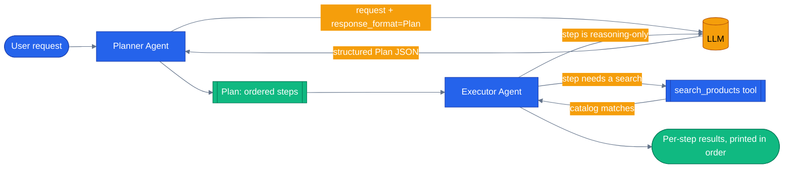

# Chapter 29 — Planner-Executor

## Why this chapter

Most of this series' orchestration chapters (02, 12+, and this repo's own default `tool`
orchestration mode) have the LLM decide **one tool call at a time**, reactively, based on
whatever it currently knows. That's simple and adaptive, but for a multi-step shopping request —
"help me put together a birthday gift for someone who likes photography under $200" — it means
you never see the whole plan before the agent starts acting. You can't approve it, estimate its
cost, or debug where it went wrong until it's already three tool calls deep.

Planner-executor flips the order: decompose the request into an ordered list of concrete steps
**up front** — the "plan," produced as structured output, not free text — and only then run each
step in sequence. The plan is inspectable before a single tool fires. This chapter builds a
minimal planner-executor pair for the e-commerce domain: a planner agent that turns a shopping
request into a `Plan` of ordered `PlanStep`s, and an executor agent that runs each step, calling
an in-memory `search_products` tool when a step needs catalog data and reasoning directly over
earlier results otherwise.

## Prerequisites

- Completed [Chapter 02 — Adding Tools](../02-add-tools/) (the `@tool` decorator shape reused here)
- Familiar with [Chapter 04 — Sessions](../04-sessions/) (`AgentSession` — the executor shares one across steps)
- Repo-root `.env` with a working LLM provider (`OPENAI_API_KEY`, or `AZURE_OPENAI_*`)

## The concept

A planner-executor system is two agents (or two roles played by one model) with a hard boundary
between them:

1. **The planner** sees only the user's request. It never touches a tool. Its one job is to
   produce a `Plan` — an ordered list of `PlanStep`s — as **structured output** (a Pydantic model
   passed as `response_format`), not prose the rest of the code would have to parse with regex.
2. **The executor** never sees the original request, only one step at a time. For each step it
   either calls a tool (if the step names a catalog search) or reasons over what earlier steps
   already produced, then returns a result. The plan itself never changes mid-run — no step
   result feeds back into re-deciding what step 3 should be.

This is the deliberate trade-off: **predictable and inspectable, at the cost of adaptability.**
The router/tool pattern (Chapter 02, and this repo's `tool` orchestration mode) has the opposite
trade-off — the LLM decides the very next action every turn, so it reacts instantly to a
surprising tool result, but there's no plan to show a user before execution starts, and no single
point to log "here's everything this run intends to do" for approval or cost estimation. Use
planner-executor when seeing the whole plan up front has real value (approval gates, cost
estimates before execution, step-by-step debugging); use reactive tool-calling when the task is
usually one hop and a full plan would be ceremony.

Note what this chapter does **not** build: automatic re-planning. If step 2's search comes back
empty, the executor still tries to run steps 3 and 4 as written. A production planner-executor
usually adds a loop that re-invokes the planner when a step's result invalidates the rest of the
plan — this repo's `docs/concepts/06-orchestration-patterns.md` names that adaptive version
**Magentic**, and it is explicitly **not implemented in this repo yet** (see Gotchas).



The plan is fully formed — and printable — before the executor runs its first step. Nothing about
step 2 depends on the planner reconsidering step 1.

## Python

Run from the repo root using the shared `tutorials/` uv project (one `uv sync` covers every chapter):

```bash
uv sync --project tutorials
uv run --project tutorials python tutorials/29-planner-executor/python/main.py
```

Source: [`python/main.py`](./python/main.py). The plan is a Pydantic model, not free text:

```python
class PlanStep(BaseModel):
    step: int = Field(description="1-based order of this step in the plan.")
    action: str = Field(description="Short human-readable description of what this step accomplishes.")
    query: str | None = Field(
        default=None,
        description="Catalog search text for this step, or null if the step only reasons over prior results.",
    )


class Plan(BaseModel):
    goal: str = Field(description="One-sentence restatement of what the user wants overall.")
    steps: list[PlanStep] = Field(description="Ordered steps that together satisfy the goal.")
```

The planner call asks for that shape directly via `response_format`, and `response.value` returns
an already-parsed `Plan` — no manual JSON parsing in this chapter's code:

```python
async def make_plan(planner: Agent, request: str) -> Plan:
    response = await planner.run(request, options={"response_format": Plan})
    plan = response.value
    if plan is None:
        raise ValueError(f"planner did not return a parseable plan; raw text: {response.text!r}")
    return plan
```

The executor runs one step at a time on a **shared session**, so step 2 ("filter by price") can
see step 1's search results without the caller re-stating them:

```python
async def run_plan(request: str) -> tuple[Plan, list[str]]:
    planner = build_planner_agent()
    executor = build_executor_agent()
    plan = await make_plan(planner, request)
    session = executor.create_session()
    results = [await run_step(executor, session, step) for step in plan.steps]
    return plan, results
```

`main()` prints the plan's goal and every step's action *before* printing any result, then walks
the results in order — the plan is visible as a distinct artifact, not folded silently into the
final answer.

## .NET

Source: [`dotnet/Program.cs`](./dotnet/Program.cs).

```bash
cd tutorials/29-planner-executor/dotnet
dotnet run
dotnet test tests/PlannerExecutor.Tests.csproj
```

Structured output uses the generic `RunAsync<T>` overload rather than Python's `response_format=`:

```csharp
var response = await planner.RunAsync<Plan>(request, serializerOptions: AIJsonUtilities.DefaultOptions);
```

`AgentResponse<T>.Result` deserializes lazily and throws on bad JSON, so `MakePlanAsync` catches it and rethrows with the raw text quoted — turning "the model ignored the schema" into one actionable message instead of a `JsonException` from somewhere inside the framework. Executing a half-parsed plan is worse than not executing one.

The session is `AgentSession`, created once and reused across every step:

```csharp
AgentSession session = await executor.CreateSessionAsync();
foreach (PlanStep step in plan.Steps)
{
    results.Add(await RunStepAsync(executor, session, step));
}
```

Two properties carry the pattern and neither is visible from the API:

- **The planner has no tools.** `The_Planner_Is_Given_No_Tools` asserts it. Give it any and it will search instead of planning, and you get a reactive agent that also emits a plan it has already stopped following.
- **Every step shares one session.** The failure mode without this is not an error: step 3 sees an empty conversation, has nothing to pick from, and invents a plausible recommendation. `All_Steps_Share_One_Session_So_Later_Steps_See_Earlier_Results` asserts the conversation grows, which is the only way to catch it.

## Gotchas

- **`response_format` goes on `run()`, not on `Agent()`.** `Agent(client, response_format=Plan, ...)` is not a
  thing — pass it per-call: `agent.run(request, options={"response_format": Plan})`. `response.value` does
  the JSON parsing; `response.text` still gives you the raw model output if parsing fails.
- **A missing or malformed structured response surfaces as `response.value is None`,** not an
  exception at call time — `make_plan()` in this chapter raises explicitly with the raw text
  attached so a bad plan fails loudly instead of the executor silently iterating zero steps.
- **The executor's `AgentSession` is shared across all steps, on purpose.** Building a fresh
  executor (or a fresh session) per step would lose step 1's search results by the time step 2
  runs — `InMemoryHistoryProvider()` on `build_executor_agent()` is what makes "filter the results
  from step 1" resolvable without re-passing them.
- **No re-planning.** If a step's tool result contradicts what the plan assumed (e.g., a search
  step returns zero matches), the executor still executes the remaining steps as literally
  written. This repo's `docs/concepts/06-orchestration-patterns.md` names the adaptive,
  re-planning version of this pattern **Magentic** — "a planner-executor pattern where a lead
  agent dynamically plans and assigns work to a team, adjusting the plan as it learns" — and is
  explicit that it's **not implemented in this repo yet**: `orchestrator/modes/get_mode()` raises
  a named `UnknownModeError` for `"magentic"` rather than silently pretending it exists (see
  `agents/python/orchestrator/modes/__init__.py:55`). This chapter is a standalone teaching
  implementation of the general pattern — it is deliberately **not** wired into
  `orchestrator/modes/` as a new production mode, to avoid a second, divergent implementation
  that would need reconciling once a real `magentic` mode eventually lands there.
- **Multiple LLM turns means multiple fixture files.** A run with a 4-step plan produces one
  planner fixture plus one executor fixture per step (more if a step drives a tool-call round
  trip) — `ReplayChatClient` keys each fixture on the exact request (messages + tools +
  instructions), so the planner and executor never collide even though they share one
  `FIXTURES_DIR`.

## Tests

```bash
uv run --project tutorials pytest tutorials/29-planner-executor/python/tests -v
```

`tutorials/29-planner-executor/python/tests/test_planner_executor.py` covers, structurally:

1. **Unit tests against the tool and models directly** — `search_products` keyword matching and
   price filtering, `PlanStep`/`Plan` construction and ordering — no LLM involved.
2. **Agent wiring** — `search_products` shows up in `build_executor_agent()`'s registered tools;
   `build_planner_agent()` builds with no tools at all (it only ever returns structured output).
3. **A replay test** (`test_replay_plans_and_executes`) that plays back committed fixtures in
   `tests/fixtures/replay/` — no network or credentials required, safe for CI. It `pytest.skip()`s
   gracefully if no fixtures have been recorded yet.
4. **Real-LLM integration tests**, skipped unless usable credentials are present — one asserts the
   planner returns a `Plan` with sequentially numbered steps, the other asserts every step in a
   full run produces a non-empty result including real catalog data.

Fixtures for this chapter were recorded against Azure OpenAI credentials found in the repo-root
`.env`:

```bash
LLM_PROVIDER=replay RECORD=true REPLAY_RECORD_PROVIDER=azure \
  uv run --project tutorials python tutorials/29-planner-executor/python/main.py
```

## How this shows up in the capstone

The executor's `search_products` tool is a toy version of the real thing. `agents/python/product_discovery/tools.py:16`
defines the production `search_products`:

```python
@tool(name="search_products", description="Search the product catalog using natural language. Supports filtering by category, price range, and rating.")
async def search_products(
```

Same `@tool` + `Annotated` shape as this chapter's version — production adds `async`, real
Postgres full-text search via `get_pool()`, and several more filter parameters, but the mechanics
of "the LLM decides when to call this and what arguments to pass" are unchanged.

The planner-executor pattern itself, however, is **not** wired into the capstone's live
orchestrator. `agents/python/orchestrator/modes/__init__.py:55` is where `get_mode()` raises a
named `UnknownModeError` for `"magentic"` — the production-grade, re-planning generalization of
what this chapter builds — confirming it's tracked as a later addition rather than silently
missing. See [`docs/concepts/06-orchestration-patterns.md`](../../docs/concepts/06-orchestration-patterns.md)
for the full comparison of every orchestration mode this repo *does* run in production.

## What's next

- Previous: [Chapter 27 — Agent-as-Tool](../27-agent-as-tool/)
- Full source: [`python/`](./python/)
- Shared: [Mermaid style guide](../_shared/mermaid-style-guide.md) · [Orchestration patterns](../../docs/concepts/06-orchestration-patterns.md)
