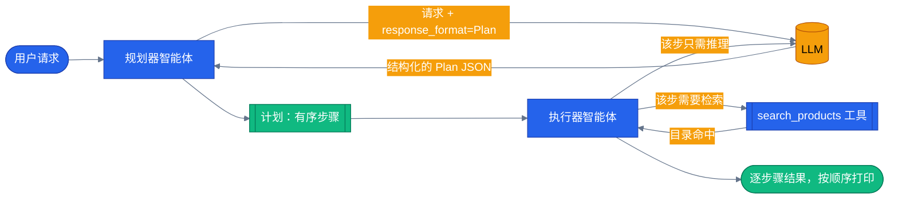

# 第 29 章 · 规划器与执行器

[项目首页](../../README.md) · [教程总览](../README.md) · [术语表](../_shared/jargon-glossary.md)

## 本章动机

本系列大多数编排章节（02、12 章之后各章，以及本仓库默认的 `tool` 编排模式）都让 LLM **一次决定一个工具调用**，反应式地、基于它当下所知的一切来做判断。这既简单又自适应，但对于一个多步购物请求 —— 「帮我给一个喜欢摄影的人挑一份 200 元以内的生日礼物」—— 这意味着在智能体开始行动之前，你永远看不到完整计划。你无法批准它、估算它的成本，或者在它已经深入三次工具调用之后才去排查哪里出了问题。

规划器-执行器把这个顺序颠倒过来：**事先**把请求分解成一个有序的具体步骤列表 —— 即「计划」，以结构化输出而非自由文本产出 —— 然后才按顺序逐步执行。计划在任何工具被触发之前就是可检视的。本章为电商领域构建一对极简的规划器-执行器：一个规划器智能体把购物请求变成由有序 `PlanStep` 组成的 `Plan`，一个执行器智能体逐条运行步骤 —— 当某一步需要商品目录数据时调用内存中的 `search_products` 工具，否则直接在前序结果之上推理。

## 前置条件

- 已完成[第 02 章 · 添加工具](../02-add-tools/)（本章复用了 `@tool` 装饰器的形态）
- 熟悉[第 04 章 · 会话持久化](../04-sessions/)（`AgentSession` —— 执行器在各步骤之间共享同一个会话）
- 仓库根目录的 `.env` 中有可用的 LLM 提供方（`OPENAI_API_KEY`，或 `AZURE_OPENAI_*`）

## 核心概念

规划器-执行器系统是两个智能体（或同一个模型扮演的两个角色），二者之间有一条硬边界：

1. **规划器**只看到用户的请求。它从不接触任何工具。它唯一的职责是产出一个 `Plan` —— 一个有序的 `PlanStep` 列表 —— 作为**结构化输出**（一个作为 `response_format` 传入的 Pydantic 模型），而不是需要其余代码用正则去解析的散文。
2. **执行器**从来看不到原始请求，每次只看一步。对每一步，它要么调用工具（如果该步指明了一次目录检索），要么在前序步骤已经产出的结果之上推理，然后返回结果。计划本身在运行中途从不改变 —— 没有任何步骤结果会回流去重新决定第 3 步应该是什么。

这就是刻意的取舍：**可预测、可检视，代价是自适应性。** 路由/工具模式（第 02 章，以及本仓库的 `tool` 编排模式）的取舍正好相反 —— LLM 每一轮都决定紧接着的下一个动作，因此它能对意外的工具结果即时反应，但在执行开始之前没有计划可以展示给用户，也没有一个单点可以记录「本次运行打算做的全部事情」以供审批或成本估算。当「事先看到完整计划」确有价值时（审批门控、执行前的成本估算、逐步调试），就用规划器-执行器；当任务通常只有一跳、一份完整计划纯属仪式时，就用反应式工具调用。

注意本章**没有**构建什么：自动重新规划。如果第 2 步的检索返回空，执行器仍会照原样尝试运行第 3、4 步。生产级的规划器-执行器通常会加一个循环，在某一步的结果使计划剩余部分失效时重新调用规划器 —— 本仓库的 `docs/concepts/06-orchestration-patterns.md` 把那个自适应版本命名为 **Magentic**，并明确指出它**尚未在本仓库中实现**（见「常见坑」）。


```mermaid
%%{init: {'theme':'base', 'themeVariables': {
  'primaryColor': '#2563eb','primaryTextColor': '#ffffff','primaryBorderColor': '#1e40af',
  'lineColor': '#64748b','secondaryColor': '#f59e0b','tertiaryColor': '#10b981',
  'background': 'transparent'}}}%%
flowchart LR
  classDef core     fill:#2563eb,stroke:#1e40af,color:#ffffff
  classDef external fill:#f59e0b,stroke:#b45309,color:#000000
  classDef success  fill:#10b981,stroke:#047857,color:#ffffff
  classDef infra    fill:#64748b,stroke:#334155,color:#ffffff

  user([用户请求]) --> planner[规划器智能体]
  planner -- "请求 + response_format=Plan" --> llm[(LLM)]
  llm -- "结构化的 Plan JSON" --> planner
  planner --> plan[[计划：有序步骤]]
  plan --> executor[执行器智能体]
  executor -- "该步需要检索" --> tool[[search_products 工具]]
  tool -- "目录命中" --> executor
  executor -- "该步只需推理" --> llm
  executor --> results([逐步骤结果，按顺序打印])

  class user core
  class planner core
  class executor core
  class llm external
  class tool core
  class plan success
  class results success
```

计划在执行器运行第一步之前就已完整成形 —— 并且可以打印出来。第 2 步不依赖规划器重新考虑第 1 步。

## Python

在仓库根目录运行，使用共享的 `tutorials/` uv 项目（一次 `uv sync` 覆盖全部章节）：

```bash
uv sync --project tutorials
uv run --project tutorials python tutorials/29-planner-executor/python/main.py
```

源码：[`python/main.py`](./python/main.py)。计划是一个 Pydantic 模型，不是自由文本：

```python
class PlanStep(BaseModel):
    step: int = Field(description="1-based order of this step in the plan.")
    action: str = Field(description="Short human-readable description of what this step accomplishes.")
    query: str | None = Field(
        default=None,
        description="Catalog search text for this step, or null if the step only reasons over prior results.",
    )


class Plan(BaseModel):
    goal: str = Field(description="One-sentence restatement of what the user wants overall.")
    steps: list[PlanStep] = Field(description="Ordered steps that together satisfy the goal.")
```

规划器调用通过 `response_format` 直接要求这个形状，而 `response.value` 返回一个已经解析好的 `Plan` —— 本章代码里没有任何手写的 JSON 解析：

```python
async def make_plan(planner: Agent, request: str) -> Plan:
    response = await planner.run(request, options={"response_format": Plan})
    plan = response.value
    if plan is None:
        raise ValueError(f"planner did not return a parseable plan; raw text: {response.text!r}")
    return plan
```

执行器在一个**共享会话**上逐条运行步骤，因此第 2 步（「按价格筛选」）能看到第 1 步的检索结果，而不需要调用方重新陈述它们：

```python
async def run_plan(request: str) -> tuple[Plan, list[str]]:
    planner = build_planner_agent()
    executor = build_executor_agent()
    plan = await make_plan(planner, request)
    session = executor.create_session()
    results = [await run_step(executor, session, step) for step in plan.steps]
    return plan, results
```

`main()` 会*先*打印计划的目标与每一步的动作，然后再打印任何结果，随后按顺序走一遍结果 —— 计划作为一个独立的产物可见，而不是被静默地折进最终回答。

## 常见坑

- **`response_format` 传给 `run()`，不是传给 `Agent()`。** `Agent(client, response_format=Plan, ...)` 这种写法不存在 —— 要按调用传：`agent.run(request, options={"response_format": Plan})`。`response.value` 负责 JSON 解析；解析失败时 `response.text` 仍然给你原始的模型输出。
- **缺失或格式错误的结构化回复会表现为 `response.value is None`，** 而不是调用时的异常 —— 本章 `make_plan()` 显式抛出并附上原始文本，让一份坏计划大声失败，而不是让执行器静默地遍历零个步骤。执行一份只解析了一半的计划，比根本不执行更糟。
- **规划器不配任何工具。** 给它工具，它就会去检索而不是做规划，你得到的是一个反应式智能体，同时还输出一份它早已不再遵循的计划。测试断言了 `build_planner_agent()` 构建出的智能体没有任何工具。
- **执行器的 `AgentSession` 有意在所有步骤之间共享。** 为每一步新建一个执行器（或新建一个会话），会让第 1 步的检索结果在第 2 步运行时已经丢失 —— `build_executor_agent()` 上的 `InMemoryHistoryProvider()` 正是让「筛选第 1 步的结果」无需重新传参即可成立的原因。没有共享会话时的失败模式不是报错：第 3 步看到一段空对话，无从挑选，于是编造一个看似合理的推荐。
- **没有重新规划。** 如果某一步的工具结果与计划的假设相矛盾（例如某个检索步骤返回零命中），执行器仍会照字面写好的内容执行剩余步骤。本仓库的 `docs/concepts/06-orchestration-patterns.md` 把这个模式的自适应、可重新规划的版本命名为 **Magentic** —— 「一种规划器-执行器模式：由主导智能体动态规划并向团队分派工作，并随其了解到的情况调整计划」—— 并明确指出它**尚未在本仓库中实现**：`orchestrator/modes/get_mode()` 会为 `"magentic"` 抛出一个具名的 `UnknownModeError`，而不是静默假装它存在（见 `agents/python/orchestrator/modes/__init__.py:57`）。本章是对该通用模式的独立教学实现 —— 它刻意**没有**作为新的生产模式接入 `orchestrator/modes/`，以避免出现第二份会发散的实现，将来真正的 `magentic` 模式落地时还要去调和它。
- **多个 LLM 轮次意味着多个夹具文件。** 一次四步计划的运行会产生一个规划器夹具，外加每一步一个执行器夹具（如果某步还驱动了一次工具调用往返则更多）—— `ReplayChatClient` 按精确请求（消息 + 工具 + 指令）给每个夹具建立键，因此规划器与执行器即便共用同一个 `FIXTURES_DIR` 也从不冲突。

## 测试

```bash
uv run --project tutorials pytest tutorials/29-planner-executor/python/tests -v
```

`tutorials/29-planner-executor/python/tests/test_planner_executor.py` 从结构上覆盖：

1. **直接针对工具与模型的单元测试** —— `search_products` 的关键词匹配与价格筛选、`PlanStep`/`Plan` 的构造与排序 —— 不涉及 LLM。
2. **智能体接线** —— `search_products` 出现在 `build_executor_agent()` 注册的工具中；`build_planner_agent()` 构建时不带任何工具（它只返回结构化输出）。
3. **一次回放测试**（`test_replay_plans_and_executes`），播放 `tests/fixtures/replay/` 中已提交的夹具 —— 不需要网络或凭据，可安全用于 CI。若尚无录制好的夹具，它会优雅地 `pytest.skip()`。
4. **真实 LLM 集成测试**，在缺少可用凭据时跳过 —— 一个断言规划器返回的 `Plan` 其步骤是连续编号的，另一个断言完整运行中每一步都产出了非空结果且包含真实目录数据。

本章的夹具是依据仓库根目录 `.env` 中的 Azure OpenAI 凭据录制的：

```bash
LLM_PROVIDER=replay RECORD=true REPLAY_RECORD_PROVIDER=azure \
  uv run --project tutorials python tutorials/29-planner-executor/python/main.py
```

## 在完整项目中的落点

执行器的 `search_products` 工具是真实实现的一个玩具版本。`agents/python/product_discovery/tools.py:31` 定义了生产版的 `search_products`：

```python
@tool(name="search_products", description="Search the product catalog using natural language. Supports filtering by category, price range, and rating.")
async def search_products(
```

与本教程版本相同的 `@tool` + `Annotated` 形态 —— 生产实现增加了 `async`、通过 `get_pool()` 访问真实的 PostgreSQL 全文检索，以及若干筛选参数，但「LLM 决定何时调用它、传什么参数」这一机制没有变化。

不过规划器-执行器这个模式本身，**没有**接入完整项目的在线编排器。`agents/python/orchestrator/modes/__init__.py:57` 正是 `get_mode()` 为 `"magentic"` 抛出具名 `UnknownModeError` 的地方 —— 那是本章所构建内容的、生产级的可重新规划泛化版 —— 这也确认了它被记为后续新增项，而不是静默缺失。关于本仓库*确实*在生产中运行的每一种编排模式的完整对比，参见 [`docs/concepts/06-orchestration-patterns.md`](../../docs/concepts/06-orchestration-patterns.md)。

## 下一步

- 上一章：[第 27 章 · 把智能体作为工具](../27-agent-as-tool/)
- 完整源码：[`python/`](./python/)
- 共享资料：[Mermaid 风格指南](../_shared/mermaid-style-guide.md) · [编排模式](../../docs/concepts/06-orchestration-patterns.md)
