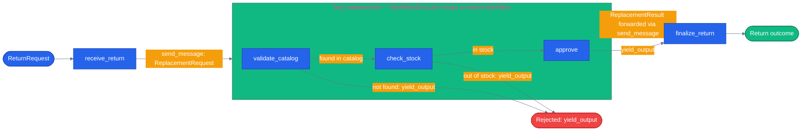

# Chapter 30 — Subworkflows

## Why this chapter

Chapters 09–13 built graphs out of executors that each do one small thing — uppercase a string, check stock, merge three results. Real systems eventually need a *step* that isn't small: "find and validate a replacement product" is itself a little pipeline (look it up, check stock, decide), not a single function call. If two different outer workflows both need that pipeline — say, a return-and-replace flow and a proactive low-stock-substitution flow — you're stuck choosing between copy-pasting three executors into each one (now you have two copies to keep in sync) or flattening the outer graph into one big pile of nodes that mixes two concerns together and loses the "outer flow" as an inspectable thing on its own. Neither is what made building it as a `WorkflowBuilder` graph worth doing in the first place.

The fix is the same one ordinary code uses for shared multi-step logic: extract it into its own subroutine, and call that subroutine from wherever it's needed. Applied to MAF workflows, the subroutine is itself a `Workflow`, and this chapter shows the real, built-in way MAF lets you nest one `Workflow` inside another as a single node of a larger graph — not a hand-rolled wrapper, an actual first-class primitive shipped with the framework.

## Prerequisites

- Completed [Chapter 09 — Workflow Executors and Edges](../09-workflow-executors-and-edges/)
- Python 3.12+ via `uv`
- No environment variables needed — this chapter runs pure, deterministic executors over a toy in-memory catalog, no LLM calls

## The concept

**Research finding, not an assumption**: `agent_framework` ships a first-class `WorkflowExecutor` class (`agent_framework._workflows._workflow_executor.WorkflowExecutor`, re-exported from the top-level `agent_framework` package) built exactly for this. Its docstring says it plainly: *"An executor that wraps a workflow to enable hierarchical workflow composition... makes a workflow behave as a single executor within a parent workflow."* You don't reach for a custom wrapper class here — you construct `WorkflowExecutor(inner_workflow, id="...")` and drop it into an outer `WorkflowBuilder` exactly where you'd otherwise put a plain `Executor`.

Mechanically: `WorkflowExecutor.__init__(self, workflow, id, allow_direct_output=False, propagate_request=False, **kwargs)` takes a `Workflow` instance (built the normal way, via `WorkflowBuilder(...).build()`) and an `id` for the wrapper node itself. When a message arrives at that node, `WorkflowExecutor` runs the wrapped workflow to completion (or to idle-with-pending-requests, for HITL-style sub-workflows), then does two things with whatever the sub-workflow produced:

- **Outputs** (anything the inner workflow's executors passed to `ctx.yield_output(...)`) are forwarded to the parent workflow as a regular `ctx.send_message(...)` by default — the next executor along the wrapper node's outbound edge receives it like any other message. Set `allow_direct_output=True` and the sub-workflow's output instead becomes the *outer* workflow's own terminal output directly, skipping whatever would normally come after the wrapper node.
- **Requests** (if an inner executor calls `ctx.request_info(...)`, e.g. a nested HITL gate) are either propagated to the parent workflow's own `request_info` mechanism (`propagate_request=True`) or wrapped in a `SubWorkflowRequestMessage` and sent to whichever executor in the parent graph is wired to receive it.

This demo builds an inner workflow, `find-replacement` (3 executors: `validate_catalog` → `check_stock` → `approve`, with two short-circuit rejections), and an outer workflow, `process-return` (`receive_return` → the wrapped inner workflow → `finalize_return`). The outer graph never duplicates the catalog/stock logic — it just points a `WorkflowExecutor` node at a freshly built inner `Workflow` instance.



The `sub` box is the whole nested `Workflow` — three executors and their own short-circuit exits — collapsed into one node (`find_replacement`) from the outer graph's point of view. The outer graph's own two edges (`receive_return → find_replacement`, `find_replacement → finalize_return`) are all `process-return` ever has to know about the inner pipeline's internals.

## Python

Run from the repo root using the shared `tutorials/` uv project (one `uv sync` covers every chapter):

```bash
uv sync --project tutorials
uv run --project tutorials python tutorials/30-subworkflows/python/main.py
```

Source: [`python/main.py`](./python/main.py). Building the inner workflow is nothing new — the same `WorkflowBuilder` shape as Chapter 09:

```python
def build_find_replacement_workflow() -> Workflow:
    validate = _ValidateCatalogExecutor()
    stock = _CheckStockExecutor()
    approve = _ApproveExecutor()
    return (
        WorkflowBuilder(start_executor=validate, name="find-replacement")
        .add_edge(validate, stock)
        .add_edge(stock, approve)
        .build()
    )
```

Nesting it inside the outer workflow is the one new piece — `WorkflowExecutor` slots into `add_edge(...)` exactly like any other `Executor`:

```python
def build_process_return_workflow() -> Workflow:
    receive = _ReceiveReturnExecutor()
    find_replacement = WorkflowExecutor(
        build_find_replacement_workflow(),
        id="find_replacement",
        allow_direct_output=False,
    )
    finalize = _FinalizeReturnExecutor()
    return (
        WorkflowBuilder(start_executor=receive, name="process-return")
        .add_edge(receive, find_replacement)
        .add_edge(find_replacement, finalize)
        .build()
    )
```

`build_find_replacement_workflow()` is called fresh inside `build_process_return_workflow()` rather than shared as a module-level instance — `WorkflowExecutor`'s own docstring warns that sharing one `Workflow` instance across more than one wrapper "may lead to incorrect behavior." Running the script drives three scenarios through the outer workflow (in catalog + in stock → approved; in catalog + no stock → rejected; not in the catalog at all → rejected), each one exercising the full nested round trip: outer receives the request, hands it to the inner workflow, inner workflow runs its own three-step graph to a `yield_output`, `WorkflowExecutor` forwards that as a message back into the outer graph, and `finalize_return` turns it into the final text.

## .NET

Source: [`dotnet/Program.cs`](./dotnet/Program.cs).

```bash
cd tutorials/30-subworkflows/dotnet
dotnet run
dotnet test tests/Subworkflows.Tests.csproj
```

The .NET nesting primitive is `SubworkflowBinding` — Python calls the same thing `WorkflowExecutor`. Both mean: a `Workflow` satisfies the executor contract, so it can go anywhere a single executor can.

```csharp
var findReplacement = new SubworkflowBinding(
    BuildFindReplacementWorkflow(),
    "find_replacement",
    ExecutorOptions.Default);

return new WorkflowBuilder(receive)
    .AddEdge(receive, findReplacement)
    .AddEdge(findReplacement, finalize)
    .WithOutputFrom(finalize)
    .Build();
```

The outer graph has three nodes; one of them happens to be three more.

`BuildFindReplacementWorkflow()` is a **factory, not a singleton**, on both sides. Sharing one `Workflow` across wrappers shares its executor instances, whose state is not designed for concurrent use — and the resulting corruption is silent.

The tests exercise the inner workflow both standalone and nested, because if it only worked in one shape it would not be a subworkflow, just a set of executors that happen to be grouped. `The_Subworkflows_Output_Is_Reshaped_Rather_Than_Yielded_Directly` pins the property that makes nesting worth anything: the inner workflow yields a `ReplacementResult` and the outer one yields a `string`. If the inner output became the outer terminal output, `finalize_return` would be skipped and the nesting would buy nothing over inlining.

## Gotchas

- **`WorkflowExecutor` is a real primitive — don't hand-roll a wrapper.** It's tempting to write a custom `Executor` subclass whose handler calls `await inner_workflow.run(...)` itself; that's redundant work here since MAF already ships `WorkflowExecutor` with output-forwarding, request/response coordination, and checkpoint integration built in. Reach for a custom wrapper only if you need behavior `WorkflowExecutor` genuinely doesn't offer.
- **Don't share one `Workflow` instance across two `WorkflowExecutor` nodes.** Both the executor instances *inside* a `Workflow` and the `Workflow` object itself carry per-run state; wrapping the same instance twice (or reusing it across two outer workflows) risks one run's in-flight state bleeding into another's. Build a fresh instance per wrapper, as `build_process_return_workflow()` does here.
- **`allow_direct_output` changes where the sub-workflow's result goes, not whether it's produced.** Leaving it `False` (the default, used here) routes the inner result to whatever the wrapper node's outbound edge points at — `finalize_return` in this demo. Setting it `True` makes the inner result the *outer* workflow's own terminal output, bypassing `finalize_return` — useful when the sub-workflow's output already *is* the final answer and there's nothing left to do with it.
- **Overlapping runs against a stateful sub-workflow are allowed but risky.** `WorkflowExecutor` keeps no bookkeeping of its own — the wrapped `Workflow` is the single source of truth for pending requests. If a second input arrives while the first run still has an outstanding `request_info` (a nested HITL gate, for example), the shared sub-workflow's state advances and can interfere with the first cycle; a logged warning is the only signal. This demo's inner workflow is stateless (pure functions over a toy dict) specifically to sidestep this.
- **A single-step sub-logic doesn't need this.** If the reusable unit is one decision or one lookup, a shared `Executor` (or even a shared `@tool`) is the right level of reuse — reach for `WorkflowExecutor` only when what you're sharing is itself a small graph with more than one step, the way `find-replacement` here is three.

## Tests

```bash
uv run --project tutorials pytest tutorials/30-subworkflows/python/tests -v
```

`tutorials/30-subworkflows/python/tests/test_subworkflows.py` covers, structurally:

1. **Inner workflow standalone** — approves an in-catalog, in-stock product; rejects an in-catalog but out-of-stock product; rejects a product not in the catalog at all; and asserts all three executors (`validate_catalog`, `check_stock`, `approve`) are wired into `build_find_replacement_workflow()`.
2. **Outer workflow end to end** — the same three scenarios, driven through `process-return`, asserting the nested round trip through `WorkflowExecutor` produces the right final text.
3. **The composition mechanic itself** — asserts the outer graph's `find_replacement` node `isinstance(..., WorkflowExecutor)` and wraps a distinct `Workflow` instance (`.workflow.id != workflow.id`), and that two separate calls to `build_process_return_workflow()` build two independent inner `Workflow` instances rather than sharing one — the exact gotcha called out above about not sharing a `Workflow` instance across wrappers.

No LLM, no replay fixtures — every assertion is exact, matching Chapter 09's precedent for workflow chapters that don't need one.

## How this shows up in the capstone

This exact composition is **not wired up in production today** — it's a real, honest pointer to where it *could* apply, not a claim that it already happens. `agents/python/workflows/return_replace.py:135` defines `_SearchReplacementsExecutor`, one step of the shipped, checkpoint/HITL-tested `ReturnReplaceMode` sequential workflow:

```python
class _SearchReplacementsExecutor(Executor):
    def __init__(self, tools: dict) -> None:
        super().__init__(id="search-replacements")
        self._tools = tools

    @handler
    async def run(self, state: WorkflowState, ctx: WorkflowContext[WorkflowState, WorkflowState]) -> None:
        fn = self._tools.get("search_products")
```

Today it's a single-step tool call — one `search_products` invocation, no sub-graph of its own, so it doesn't need `WorkflowExecutor` as it stands. But `agents/python/workflows/pre_purchase.py` is itself a small multi-step research workflow (fan-out to reviews/stock/price-history, fan-in, synthesize — see [Chapter 09's capstone section](../09-workflow-executors-and-edges/README.md#how-this-shows-up-in-the-capstone)). If `_SearchReplacementsExecutor` ever needed that same fan-out research — checking reviews and price history for *candidate replacements*, not just a flat `search_products` call — nesting `pre_purchase.py`'s workflow inside `return_replace.py` via `WorkflowExecutor` is exactly the mechanism this chapter teaches. That's a deliberate, larger, separately-reviewed follow-up — not something this chapter's tutorial code touches, and not something `return_replace.py` does today.

## What's next

This chapter is part of a batch landing alongside Chapters 28 (Reflection and Critique), 29 (Planner-Executor), 31 (Retry and Compensation), and 32 — see the top-level [`tutorials/README.md`](../README.md) for the current full chapter index.

- Full source: [`python/`](./python/)
- Shared: [Mermaid style guide](../_shared/mermaid-style-guide.md) · [Jargon glossary](../_shared/jargon-glossary.md)
- Related concept doc: [Graphs in agent systems](../../docs/concepts/07-graphs-in-agent-systems.md)
