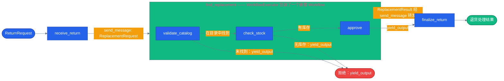

# 第 30 章 · 子工作流

[项目首页](../../README.md) · [教程总览](../README.md) · [术语表](../_shared/jargon-glossary.md)

## 本章动机

第 09–13 章用「每个只做一件小事的执行器」搭出了图 —— 把字符串转大写、检查库存、合并三个结果。真实系统迟早会需要一个*不*小的步骤：「找到并校验一件替换商品」本身就是一条小流水线（查询、检查库存、决策），而不是一次函数调用。如果两个不同的外层工作流都需要这条流水线 —— 比如一个退货换货流程和一个主动的低库存替换流程 —— 你就只能二选一：要么把三个执行器复制粘贴进每一个（于是你有两份需要同步维护的副本），要么把外层图摊平成一堆混着两种关注点的节点，从而丧失「外层流程」作为一个可独立检视之物。两者都背离了当初把它做成 `WorkflowBuilder` 图的价值。

解决办法与普通代码处理「可复用的多步逻辑」时所用的完全相同：把它抽成一个自己的子程序，然后在任何需要的地方调用这个子程序。套用到 MAF 工作流上，这个子程序本身就是一个 `Workflow`；本章展示 MAF 提供的真实、内置的嵌套方式 —— 把一个 `Workflow` 作为更大图中的一个节点嵌进去 —— 这不是手搓的包装器，而是框架自带的一等原语。

## 前置条件

- 已完成[第 09 章 · 工作流执行器与边](../09-workflow-executors-and-edges/)
- 通过 `uv` 使用 Python 3.12+
- 无需任何环境变量 —— 本章在玩具级的内存商品目录上运行纯确定性执行器，不调用 LLM

## 核心概念

**这是调研结论，不是假设**：`agent_framework` 自带一个一等的 `WorkflowExecutor` 类（`agent_framework._workflows._workflow_executor.WorkflowExecutor`，并从顶层 `agent_framework` 包重新导出），正是为此而构建。它的 docstring 说得很直白：*「一个包装工作流的执行器，用于支持层级式工作流组合……使一个工作流在父工作流中表现得像单个执行器。」* 你不需要为此去找一个自定义包装类 —— 构造 `WorkflowExecutor(inner_workflow, id="...")`，然后把它放进外层 `WorkflowBuilder` 中原本该放普通 `Executor` 的位置。

从机制上说：`WorkflowExecutor.__init__(self, workflow, id, allow_direct_output=False, propagate_request=False, **kwargs)` 接收一个 `Workflow` 实例（按常规方式通过 `WorkflowBuilder(...).build()` 构建）以及一个给包装节点自身用的 `id`。当消息到达该节点时，`WorkflowExecutor` 会把被包装的工作流运行到完成（对于 HITL 型子工作流，则运行到「空闲但有未决请求」），然后对子工作流产出的东西做两件事：

- **输出**（内层工作流各执行器传给 `ctx.yield_output(...)` 的任何内容）默认会作为一次普通的 `ctx.send_message(...)` 转发给父工作流 —— 包装节点出边上紧接着的那个执行器会像接收任何其他消息一样收到它。设置 `allow_direct_output=True` 后，子工作流的输出会直接成为*外层*工作流自己的终末输出，跳过原本会跟在包装节点之后的一切。
- **请求**（如果某个内层执行器调用了 `ctx.request_info(...)`，例如一道嵌套的 HITL 关卡）要么被传播到父工作流自己的 `request_info` 机制（`propagate_request=True`），要么被包进一个 `SubWorkflowRequestMessage`，发送给父图中接线接收它的那个执行器。

本演示构建一个内层工作流 `find-replacement`（3 个执行器：`validate_catalog` → `check_stock` → `approve`，带两条短路拒绝路径），以及一个外层工作流 `process-return`（`receive_return` → 被包装的内层工作流 → `finalize_return`）。外层图从不重复商品目录/库存逻辑 —— 它只是把一个 `WorkflowExecutor` 节点指向一个新建的内层 `Workflow` 实例。


```mermaid
%%{init: {'theme':'base', 'themeVariables': {
  'primaryColor': '#2563eb','primaryTextColor': '#ffffff','primaryBorderColor': '#1e40af',
  'lineColor': '#64748b','secondaryColor': '#f59e0b','tertiaryColor': '#10b981',
  'background': 'transparent'}}}%%
flowchart LR
  classDef core     fill:#2563eb,stroke:#1e40af,color:#ffffff
  classDef success  fill:#10b981,stroke:#047857,color:#ffffff
  classDef error    fill:#ef4444,stroke:#b91c1c,color:#ffffff

  input([ReturnRequest])
  receive[receive_return]
  finalize[finalize_return]
  output([退货处理结果])
  rejected([拒绝：yield_output])

  subgraph sub["find_replacement —— WorkflowExecutor 包装了一个嵌套 Workflow"]
    direction LR
    validate[validate_catalog]
    stock[check_stock]
    approve[approve]
    validate -- "在目录中找到" --> stock
    stock -- "有库存" --> approve
  end

  input --> receive
  receive -- "send_message: ReplacementRequest" --> sub
  validate -- "未找到：yield_output" --> rejected
  stock -- "无库存：yield_output" --> rejected
  sub -- "ReplacementResult 经 send_message 转发" --> finalize
  approve -- "yield_output" --> finalize
  finalize --> output

  class receive core
  class finalize core
  class validate core
  class stock core
  class approve core
  class output success
  class rejected error
```

那个 `sub` 方框就是整个嵌套 `Workflow` —— 三个执行器加上它们各自的短路出口 —— 从外层图的视角看被折叠成了一个节点（`find_replacement`）。外层图自己的两条边（`receive_return → find_replacement`、`find_replacement → finalize_return`）就是 `process-return` 对内层流水线内部实现所需要了解的全部。

## Python

在仓库根目录运行，使用共享的 `tutorials/` uv 项目（一次 `uv sync` 覆盖全部章节）：

```bash
uv sync --project tutorials
uv run --project tutorials python tutorials/30-subworkflows/python/main.py
```

源码：[`python/main.py`](./python/main.py)。构建内层工作流没有任何新东西 —— 与第 09 章相同的 `WorkflowBuilder` 形态：

```python
def build_find_replacement_workflow() -> Workflow:
    validate = _ValidateCatalogExecutor()
    stock = _CheckStockExecutor()
    approve = _ApproveExecutor()
    return (
        WorkflowBuilder(start_executor=validate, name="find-replacement")
        .add_edge(validate, stock)
        .add_edge(stock, approve)
        .build()
    )
```

把它嵌进外层工作流才是唯一的新东西 —— `WorkflowExecutor` 放进 `add_edge(...)` 的方式与其他任何 `Executor` 完全一样：

```python
def build_process_return_workflow() -> Workflow:
    receive = _ReceiveReturnExecutor()
    find_replacement = WorkflowExecutor(
        build_find_replacement_workflow(),
        id="find_replacement",
        allow_direct_output=False,
    )
    finalize = _FinalizeReturnExecutor()
    return (
        WorkflowBuilder(start_executor=receive, name="process-return")
        .add_edge(receive, find_replacement)
        .add_edge(find_replacement, finalize)
        .build()
    )
```

`build_find_replacement_workflow()` 是在 `build_process_return_workflow()` 内部被新调用的，而不是作为一个模块级实例共享 —— `WorkflowExecutor` 自己的 docstring 警告说，把一个 `Workflow` 实例共享给多于一个包装器「可能导致不正确行为」。运行脚本会让三种场景流过外层工作流（在目录中且有库存 → 通过；在目录中但无库存 → 拒绝；完全不在目录中 → 拒绝），每一种都完整走一遍嵌套往返：外层收到请求、交给内层工作流、内层工作流跑完自己的三步图并 `yield_output`、`WorkflowExecutor` 把它作为消息转发回外层图、`finalize_return` 把它变成最终文本。

## 常见坑

- **`WorkflowExecutor` 是真实原语 —— 不要手搓包装器。** 很容易想去写一个自定义 `Executor` 子类，在它的处理函数里自己调用 `await inner_workflow.run(...)`；但在这里那是重复劳动，因为 MAF 已经自带 `WorkflowExecutor`，内置了输出转发、请求/响应协调与检查点集成。只有当 `WorkflowExecutor` 确实不提供你所需的行为时，才去用自定义包装器。
- **不要把同一个 `Workflow` 实例共享给两个 `WorkflowExecutor` 节点。** `Workflow` *内部*的执行器实例以及 `Workflow` 对象本身都带有按次运行的状态；把同一个实例包装两次（或在两个外层工作流之间复用它）会让一次运行的在途状态渗进另一次。为每个包装器新建一个实例，正如 `build_process_return_workflow()` 在这里所做的那样。
- **`allow_direct_output` 改变的是子工作流结果*去向哪里*，而不是它是否被产出。** 保持 `False`（默认值，本章所用）会把内层结果路由到包装节点出边所指向的对象 —— 本演示中是 `finalize_return`。设为 `True` 则让内层结果成为*外层*工作流自己的终末输出，绕过 `finalize_return` —— 当子工作流的输出本身*就是*最终答案、对它已无事可做时，这很有用。
- **对有状态子工作流的重叠运行是被允许的，但有风险。** `WorkflowExecutor` 自己不保留任何记账 —— 被包装的 `Workflow` 是未决请求的唯一真相来源。如果在第一次运行仍有未决的 `request_info`（例如一道嵌套的 HITL 关卡）时来了第二个输入，共享子工作流的状态就会前进，并可能干扰第一个周期；唯一的信号是一条日志警告。本演示的内层工作流刻意做成无状态的（对玩具字典的纯函数），正是为了规避这一点。
- **单步的子逻辑不需要它。** 如果可复用的单元只是一个决策或一次查询，共享一个 `Executor`（甚至共享一个 `@tool`）才是合适的复用层级 —— 只有当你要共享的东西本身就是一张多于一步的小图时，才动用 `WorkflowExecutor`，就像这里的 `find-replacement` 是三步。

## 测试

```bash
uv run --project tutorials pytest tutorials/30-subworkflows/python/tests -v
```

`tutorials/30-subworkflows/python/tests/test_subworkflows.py` 从结构上覆盖：

1. **内层工作流独立运行** —— 通过一个在目录中且有库存的商品；拒绝一个在目录中但无库存的商品；拒绝一个完全不在目录中的商品；并断言三个执行器（`validate_catalog`、`check_stock`、`approve`）都接进了 `build_find_replacement_workflow()`。
2. **外层工作流端到端** —— 同样的三种场景，经 `process-return` 驱动，断言穿过 `WorkflowExecutor` 的嵌套往返产出了正确的最终文本。
3. **组合机制本身** —— 断言外层图的 `find_replacement` 节点 `isinstance(..., WorkflowExecutor)` 且包装了一个不同的 `Workflow` 实例（`.workflow.id != workflow.id`），并且两次分别调用 `build_process_return_workflow()` 会构建出两个相互独立的内层 `Workflow` 实例而不是共享一个 —— 正是上文那条「不要把 `Workflow` 实例共享给多个包装器」的常见坑。

测试同时以独立形态和嵌套形态演练内层工作流 —— 因为如果它只在一种形态下能工作，那它就不是子工作流，而只是一组恰好被归在一起的执行器。这里的关键性质是：内层工作流产出的是 `ReplacementResult`，而外层工作流产出的是 `string`；如果内层输出直接变成了外层终末输出，`finalize_return` 就会被跳过，嵌套相对于内联就什么也没换来。

没有 LLM，没有回放夹具 —— 每一条断言都是精确的，与第 09 章为「不需要 LLM 的工作流章节」所立的先例一致。

## 在完整项目中的落点

这种组合方式**今天并未接入生产** —— 它是一处真实、诚实的指引，指向它*可以*适用的地方，而不是在声称它已经发生。`agents/python/workflows/return_replace.py:232` 定义了 `_SearchReplacementsExecutor`，它是已上线、经过检查点/HITL 测试的 `ReturnReplaceMode` 顺序工作流中的一步：

```python
class _SearchReplacementsExecutor(Executor):
    def __init__(self, tools: dict) -> None:
        super().__init__(id="search-replacements")
        self._tools = tools

    @handler
    async def run(self, state: WorkflowState, ctx: WorkflowContext[WorkflowState, WorkflowState]) -> None:
        fn = self._tools.get("search_products")
```

今天它是一次单步工具调用 —— 一次 `search_products` 调用，没有自己的子图，因此就现状而言并不需要 `WorkflowExecutor`。但 `agents/python/workflows/pre_purchase.py` 本身就是一条小型的多步调研工作流（向评论/库存/价格历史扇出、扇入、综合 —— 参见[第 09 章的完整项目落点小节](../09-workflow-executors-and-edges/README.md#在完整项目中的落点)）。如果 `_SearchReplacementsExecutor` 有一天也需要同样的扇出式调研 —— 为*候选替换商品*检查评论与价格历史，而不只是一次扁平的 `search_products` 调用 —— 那么用 `WorkflowExecutor` 把 `pre_purchase.py` 的工作流嵌进 `return_replace.py`，正是本章所讲授的机制。那是一次刻意的、规模更大、需要单独评审的后续工作 —— 不是本章教程代码所触及的内容，也不是 `return_replace.py` 今天在做的事。

## 下一步

本章与第 28 章（反思与批评）、第 29 章（规划器与执行器）、第 31 章（重试与补偿）、第 32 章同批落地 —— 当前完整章节索引见顶层 [`tutorials/README.md`](../README.md)。

- 完整源码：[`python/`](./python/)
- 共享资料：[Mermaid 风格指南](../_shared/mermaid-style-guide.md) · [术语表](../_shared/jargon-glossary.md)
- 相关概念文档：[智能体系统中的图](../../docs/concepts/07-graphs-in-agent-systems.md)
