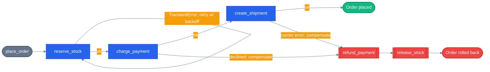

# Chapter 31 — Retry and Compensation (Saga Pattern)

A saga is what you build when a multi-step process has no single transaction to roll back. This chapter is standalone orchestration logic — no LLM, no agent reasoning — because the pattern itself doesn't need one: it's plain code that decides what to retry, what to undo, and in what order.

## Why this chapter

Placing an order in the capstone app touches at least three independent things: reserve inventory, charge a payment, create a shipment. In a single Postgres database, three `UPDATE`s inside one transaction either all commit or all roll back automatically — that's what `BEGIN`/`COMMIT`/`ROLLBACK` is for. But the moment those three steps are three separate API calls to three separate services (even if, in this repo, they're all backed by the same Postgres instance today, the point generalizes to the day one of them is a third-party payment gateway or shipping carrier), there is no shared transaction spanning them. If step three fails, steps one and two already committed for real. Nothing rolls them back for you.

The **saga pattern** is the fix: give every step an explicit **compensating action** — the opposite operation that undoes it — and if a later step fails, walk backward through the steps that already succeeded, running their compensations in reverse order. `reserve_stock` pairs with `release_stock`. `charge_payment` pairs with `refund_payment`. `create_shipment` pairs with `cancel_shipment`. Nobody has to log into a database console and manually clean up an order that's half-placed.

**Retries are a related but separate idea, and conflating them is the most common mistake.** A **transient** failure — a network timeout talking to the inventory service, a connection reset — is worth retrying with backoff, because the same call will probably succeed a moment later. A **genuine** failure — a declined credit card, an item that's actually out of stock — will not succeed if you call it again with the same arguments. Retrying a declined payment doesn't turn it into an approved one; it just wastes time and, if the call isn't idempotent, risks a double charge. The rule this chapter's demo enforces: retry only on a transient-error type, and only for steps explicitly marked retryable; anything else compensates immediately.

**When it matters:** any multi-step process spanning independent services or API calls, where a step failing partway through leaves the system in a state a human would otherwise have to clean up by hand. **When it's overkill:** a single-step operation (nothing to unwind), or a multi-step process where partial completion is genuinely harmless — e.g. logging an analytics event after an order already succeeded; losing that log entry needs no compensation, just a retry or a shrug.

## Prerequisites

- Completed [Chapter 30 — Subworkflows](../30-subworkflows/)
- Python 3.12+ via `uv`
- No environment variables needed and no LLM calls — this chapter's saga engine is deterministic orchestration logic

## The concept

The demo models a toy "place an order" saga against in-memory dictionaries standing in for three independent services (no real DB or HTTP calls, so the example stays fast and dependency-free):

| Step | Action | Compensation |
|------|--------|--------------|
| 1 | `reserve_stock(product_id, qty)` | `release_stock(product_id, qty)` |
| 2 | `charge_payment(order_id, amount)` | `refund_payment(order_id)` |
| 3 | `create_shipment(order_id)` | `cancel_shipment(order_id)` |

A tiny saga engine (`run_saga`) runs the steps in order. Each step is a `SagaStep` — an action, its matching compensation, and whether it's `retryable`. If a step's action raises `TransientError` and it's marked retryable, the engine retries with exponential backoff up to a max attempt count. If a step raises anything else (a genuine failure like `PaymentDeclinedError`), the engine stops immediately and walks backward through every step that already completed, calling each one's compensation — printing exactly what happened at each stage so the unwind is visible in the demo's output.



Compensation always runs in the *reverse* of completion order: if `charge_payment` succeeded after `reserve_stock`, an unwind refunds the payment before it releases the stock — the same order you'd want a human doing manual cleanup to follow.

## Python

Run from the repo root using the shared `tutorials/` uv project (one `uv sync` covers every chapter):

```bash
uv sync --project tutorials
uv run --project tutorials python tutorials/31-retry-and-compensation/python/main.py
```

Source: [`python/main.py`](./python/main.py). The saga engine's core loop — retry transient failures, compensate on anything else:

```python
def run_saga(order_id: str, steps: list[SagaStep], *, max_attempts: int = 3, base_delay: float = 0.0) -> SagaResult:
    completed: list[SagaStep] = []
    for step in steps:
        attempt = 0
        while True:
            attempt += 1
            try:
                step.action()
            except TransientError as exc:
                if step.retryable and attempt < max_attempts:
                    delay = base_delay * (2 ** (attempt - 1))
                    print(f"  [retry] {step.name}: {exc} (attempt {attempt}/{max_attempts}, backing off {delay:.2f}s)")
                    if delay:
                        time.sleep(delay)
                    continue
                print(f"  [failed] {step.name}: {exc} (retries exhausted)")
                compensated = _compensate(completed)
                return SagaResult(order_id, False, [s.name for s in completed], step.name, compensated)
            except Exception as exc:
                print(f"  [failed] {step.name}: {exc} (not retryable — compensating immediately)")
                compensated = _compensate(completed)
                return SagaResult(order_id, False, [s.name for s in completed], step.name, compensated)
            else:
                print(f"  [ok] {step.name}")
                completed.append(step)
                break
    return SagaResult(order_id, True, [s.name for s in completed])
```

`_compensate` is the unwind — it's the whole pattern in four lines:

```python
def _compensate(completed: list[SagaStep]) -> list[str]:
    compensated: list[str] = []
    for step in reversed(completed):
        print(f"  [compensate] undoing {step.name}")
        step.compensation()
        compensated.append(step.name)
    return compensated
```

Running `main.py` plays out three scenarios back to back:

```text
=== Scenario 1: happy path — all three steps succeed ===
  [ok] reserve_stock
  [ok] charge_payment
  [ok] create_shipment
  [done] order order-1 placed successfully

=== Scenario 2: transient network blip on reserve_stock, retried, then succeeds ===
  [retry] reserve_stock: inventory service timed out (attempt 1) (attempt 1/3, backing off 0.01s)
  [retry] reserve_stock: inventory service timed out (attempt 2) (attempt 2/3, backing off 0.02s)
  [ok] reserve_stock
  [ok] charge_payment
  [ok] create_shipment
  [done] order order-2 placed successfully

=== Scenario 3: payment declined — genuine failure, unwind reserved stock ===
  [ok] reserve_stock
  [failed] charge_payment: payment declined for order order-3 (not retryable — compensating immediately)
  [compensate] undoing reserve_stock
```

Scenario 2 shows a transient error retried into a success. Scenario 3 shows a genuine failure (`PaymentDeclinedError`) skip retries entirely and unwind the one step that had already completed.

## .NET

Source: [`dotnet/Program.cs`](./dotnet/Program.cs).

```bash
cd tutorials/31-retry-and-compensation/dotnet
dotnet run
dotnet test tests/Saga.Tests.csproj
```

No LLM and no MAF packages — the saga pattern is plain orchestration logic. The transient/genuine split is expressed as an exception filter, which reads more directly than Python's nested `try`:

```csharp
catch (TransientException ex) when (step.Retryable && attempt < maxAttempts)
{
    // exponential backoff, then retry
}
catch (TransientException ex)  { return Unwind(...); }   // budget spent
catch (Exception ex)           { return Unwind(...); }   // genuine failure
```

The `when` clause is load-bearing: a `TransientException` on a step that did not opt into retries, or after the budget is spent, falls through to compensation rather than looping.

Being LLM-free makes this the one chapter whose tests can assert **the state of the world** after a failure rather than a return value:

```csharp
backends.Stock["widget"].Should().Be(before);
backends.Reservations.GetValueOrDefault("widget").Should().Be(0);
backends.Payments.Should().NotContainKey("order-3");
```

A result object reporting `compensated` while stock stays decremented is the exact bug the pattern exists to prevent, and it is invisible from the return value alone.

Two edge cases get their own tests because they are the ones written wrong: failing at step one means the unwind loop runs zero times (an implementation assuming at least one completed step throws instead of returning cleanly), and an out-of-stock failure must not be retried — retrying will not conjure inventory, and getting it wrong turns an instant correct "no" into three round trips and the same "no".

## This chapter vs a real production saga

This demo simplifies several things a production saga implementation would need to take seriously:

| Aspect | This chapter | Production concern |
|--------|--------------|---------------------|
| State | In-memory `dict`s inside a `Backends` object, lost on process exit | Durable state — a saga log or outbox table surviving a crash mid-saga |
| Idempotency | Not addressed — a retried `charge_payment` call is assumed side-effect-free to repeat | A retried "charge card" call against a real payment gateway needs an idempotency key, or a retry risks a double charge |
| Compensation failure | Assumed to always succeed | A compensation call can itself fail (the refund API is down) — production needs its own retry/dead-letter path for compensations, not just the primary step |
| Concurrency | One saga runs synchronously, start to finish, in one function call | Real sagas often coordinate across process restarts via a message queue or workflow engine (e.g. Temporal, MassTransit's saga state machine, or a durable MAF workflow with checkpoints — see [Chapter 18 — State and Checkpoints](../18-state-and-checkpoints/)) |

## Gotchas

- **Don't retry a genuine failure.** A declined payment or an out-of-stock item will not become a success on the next attempt with the same arguments. This demo's engine only retries steps raising `TransientError` *and* explicitly marked `retryable=True` — everything else compensates on the first failure. Retrying blindly (e.g. wrapping every step in a generic `except Exception: retry`) is the single most common mistake with this pattern.
- **Compensation order is reverse of completion order, not reverse of declaration order.** If a saga has steps A, B, C and C fails after only A and B completed, the unwind runs B's compensation then A's — never a step that never ran.
- **A compensating action must actually be the opposite of its step**, not just "something related." `refund_payment` needs to know the exact `order_id` (and in a real system, the exact charge id) it's undoing — a compensation that refunds "however much is in the account" instead of "exactly what this step charged" corrupts state instead of fixing it.
- **This chapter's retry has no jitter.** `base_delay * 2 ** (attempt - 1)` is plain exponential backoff. Production retry logic typically adds random jitter to avoid a thundering herd when many callers back off in lockstep — out of scope here to keep the demo's output deterministic and testable.
- **Real compensations aren't guaranteed to succeed either.** This demo assumes every compensating action succeeds. A production saga has to handle a compensation itself failing (e.g. the refund API is down) — usually with its own retry policy or a dead-letter queue for manual follow-up, which this toy example doesn't model.

## Tests

```bash
uv run --project tutorials pytest tutorials/31-retry-and-compensation/python/tests -v
```

`tutorials/31-retry-and-compensation/python/tests/test_retry_and_compensation.py` covers, structurally:

1. **Happy path** — all three steps complete, nothing is compensated, and every backend's state reflects the successful order.
2. **Genuine failure compensates immediately** — a declined payment stops the saga and unwinds only the steps that already completed, in reverse order; a failing `create_shipment` unwinds both earlier steps (payment refunded before stock released).
3. **Transient failure is retried** — a flaky `reserve_stock` that fails twice then succeeds completes the saga without compensation once retries exhaust the simulated flakiness; a `reserve_stock` that never stops failing exhausts `max_attempts` and then compensates (with nothing to compensate, since it was the first step).
4. **Retryability is per-step, not global** — a `TransientError` raised by a step explicitly marked `retryable=False` is *not* retried; the saga compensates on the first failure.
5. **The unwind is actually visible** — a `capsys`-based test asserts the printed `[compensate]` lines appear in the correct reverse order.

## How this shows up in the capstone

There is no saga or compensation code in this repo today — verified with `grep -rniE "saga|compensat" agents/python --include="*.py"`, which returns nothing. The closest existing real code is `agents/python/orchestrator/agent.py:116`-`138`, the blocking-path `try`/`except` around the orchestrator's A2A call to a specialist agent:

```python
try:
    async with httpx.AsyncClient(timeout=30) as client:
        resp = await client.post(f"{url}/message:send", json=request_body, headers=headers)
        resp.raise_for_status()
        data = resp.json()
        ...
        return data.get("response", resp.text)
except httpx.TimeoutException:
    logger.error("a2a.timeout target=%s", agent_name)
    return f"The {agent_name} agent took too long to respond. Please try again."
except httpx.HTTPStatusError as e:
    logger.error("a2a.error target=%s status=%s", agent_name, e.response.status_code)
    return f"The {agent_name} agent returned an error (status {e.response.status_code}). Please try again."
except Exception:
    logger.exception("a2a.failure target=%s", agent_name)
    return f"Failed to reach the {agent_name} agent. Please try again later."
```

Be clear about what this is and isn't: it's plain error handling around a **single** HTTP call — catch the exception, log it, return a user-facing message. It does not retry, and it does not unwind any earlier completed step, because `call_specialist_agent` is not part of a multi-step transaction with anything to unwind — there's no saga here to compensate. This repo's future idempotency/production-hardening phase is the expected place real saga-style compensation would eventually land (e.g. if checkout ever grew into "reserve stock via specialist A, charge via specialist B, ship via specialist C" as three separate A2A calls), but as of this chapter, that code doesn't exist. This chapter is deliberately greenfield, standalone, tutorial-only content — teaching the pattern for the day it's needed.

## What's next

- Next chapter: Chapter 32 (landing alongside this one as part of the same batch — link will be wired up once its README merges)
- Full source: [`python/`](./python/)
- Shared: [Mermaid style guide](../_shared/mermaid-style-guide.md)
