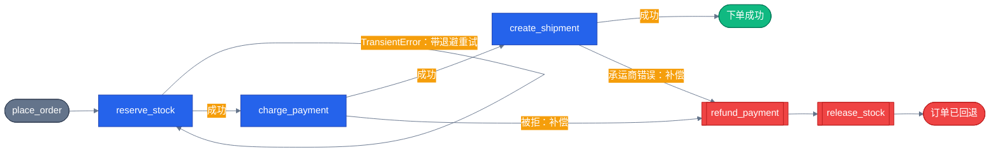

# 第 31 章 · 重试与补偿（Saga 模式）

[项目首页](../../README.md) · [教程总览](../README.md) · [术语表](../_shared/jargon-glossary.md)

当一个多步流程没有可供回滚的单一事务时，你要构建的就是 Saga。本章是独立的编排逻辑 —— 没有 LLM，没有智能体推理 —— 因为这个模式本身不需要它们：它就是决定重试什么、撤销什么、以什么顺序来做的普通代码。

## 本章动机

在完整项目里下一单至少触及三件相互独立的事情：预留库存、扣款、创建运单。在单个 PostgreSQL 数据库里，一个事务内的三条 `UPDATE` 要么全部提交、要么全部自动回滚 —— 这正是 `BEGIN`/`COMMIT`/`ROLLBACK` 的用途。但一旦这三步变成对三个独立服务的三次独立 API 调用（即便在本仓库中它们今天都落在同一个 PostgreSQL 实例上，这个论点在其中一个变成第三方支付网关或承运商的那天依然成立），就不存在横跨它们的共享事务了。如果第三步失败，第一步和第二步已经真实提交了。没有任何东西会替你回滚它们。

**Saga 模式**就是解药：给每一步配一个明确的**补偿动作** —— 即撤销它的相反操作 —— 如果后续某步失败，就沿已经成功的步骤倒着走，按相反顺序执行它们的补偿。`reserve_stock` 与 `release_stock` 配对。`charge_payment` 与 `refund_payment` 配对。`create_shipment` 与 `cancel_shipment` 配对。没有人需要登录数据库控制台去手工清理一张下了一半的订单。

**重试是一个相关但不同的概念，把它们混为一谈是最常见的错误。** **瞬时性**失败 —— 与库存服务通信时的网络超时、连接被重置 —— 值得带退避地重试，因为同一个调用过一会儿多半会成功。**真实**失败 —— 信用卡被拒、商品确实没有库存 —— 用同样的参数再调一次也不会成功。重试一次被拒的支付不会把它变成被批准的；它只是浪费时间，而且如果该调用不是幂等的，还有重复扣款的风险。本章演示所执行的规则是：只对瞬时错误类型重试，且只对显式标记为可重试的步骤重试；其他任何情况立即补偿。

**什么时候它重要：**任何横跨独立服务或 API 调用的多步流程，其中某一步中途失败会把系统留在一个本来需要人工清理的状态。**什么时候它是杀鸡用牛刀：**单步操作（没有东西需要回退），或者部分完成确实无害的多步流程 —— 例如订单已经成功之后再记一条分析事件；丢掉那条日志不需要任何补偿，重试一下或者耸耸肩就过去了。

## 前置条件

- 已完成[第 30 章 · 子工作流](../30-subworkflows/)
- 通过 `uv` 使用 Python 3.12+
- 无需环境变量，也不调用 LLM —— 本章的 Saga 引擎是确定性的编排逻辑

## 核心概念

演示用内存字典代替三个独立服务，建模了一个玩具级的「下单」Saga（没有真实数据库或 HTTP 调用，因此示例保持快速、无外部依赖）：

| 步骤 | 动作 | 补偿 |
|------|--------|--------------|
| 1 | `reserve_stock(product_id, qty)` | `release_stock(product_id, qty)` |
| 2 | `charge_payment(order_id, amount)` | `refund_payment(order_id)` |
| 3 | `create_shipment(order_id)` | `cancel_shipment(order_id)` |

一个极小的 Saga 引擎（`run_saga`）按顺序运行各步骤。每一步是一个 `SagaStep` —— 一个动作、与之配对的补偿，以及它是否 `retryable`。如果某步的动作抛出 `TransientError` 且该步被标记为可重试，引擎就会以指数退避重试，直到达到最大尝试次数。如果某步抛出任何其他异常（例如 `PaymentDeclinedError` 这样的真实失败），引擎立即停止，并沿每一个已经完成的步骤倒着走，调用各自的补偿 —— 同时把每个阶段发生的事精确打印出来，好让回退过程在演示输出中可见。


```mermaid
%%{init: {'theme':'base', 'themeVariables': {
  'primaryColor': '#2563eb','primaryTextColor': '#ffffff','primaryBorderColor': '#1e40af',
  'lineColor': '#64748b','secondaryColor': '#f59e0b','tertiaryColor': '#10b981',
  'background': 'transparent'}}}%%
flowchart LR
  classDef core     fill:#2563eb,stroke:#1e40af,color:#ffffff
  classDef success  fill:#10b981,stroke:#047857,color:#ffffff
  classDef error    fill:#ef4444,stroke:#b91c1c,color:#ffffff
  classDef infra    fill:#64748b,stroke:#334155,color:#ffffff

  start([place_order])
  reserve[reserve_stock]
  charge[charge_payment]
  ship[create_shipment]
  ok([下单成功])
  refund[[refund_payment]]
  release[[release_stock]]
  failed([订单已回退])

  start --> reserve
  reserve -- "TransientError：带退避重试" --> reserve
  reserve -- 成功 --> charge
  charge -- 成功 --> ship
  ship -- 成功 --> ok
  charge -- "被拒：补偿" --> refund
  ship -- "承运商错误：补偿" --> refund
  refund --> release
  release --> failed

  class reserve core
  class charge core
  class ship core
  class ok success
  class refund error
  class release error
  class failed error
  class start infra
```

补偿总是按完成顺序的*相反*顺序运行：如果 `charge_payment` 在 `reserve_stock` 之后成功，那么一次回退会先退款、再释放库存 —— 与你希望人工手动清理时所遵循的顺序相同。

## Python

在仓库根目录运行，使用共享的 `tutorials/` uv 项目（一次 `uv sync` 覆盖全部章节）：

```bash
uv sync --project tutorials
uv run --project tutorials python tutorials/31-retry-and-compensation/python/main.py
```

源码：[`python/main.py`](./python/main.py)。Saga 引擎的核心循环 —— 重试瞬时失败，其他一切情况都补偿：

```python
def run_saga(order_id: str, steps: list[SagaStep], *, max_attempts: int = 3, base_delay: float = 0.0) -> SagaResult:
    completed: list[SagaStep] = []
    for step in steps:
        attempt = 0
        while True:
            attempt += 1
            try:
                step.action()
            except TransientError as exc:
                if step.retryable and attempt < max_attempts:
                    delay = base_delay * (2 ** (attempt - 1))
                    print(f"  [retry] {step.name}: {exc} (attempt {attempt}/{max_attempts}, backing off {delay:.2f}s)")
                    if delay:
                        time.sleep(delay)
                    continue
                print(f"  [failed] {step.name}: {exc} (retries exhausted)")
                compensated = _compensate(completed)
                return SagaResult(order_id, False, [s.name for s in completed], step.name, compensated)
            except Exception as exc:
                print(f"  [failed] {step.name}: {exc} (not retryable — compensating immediately)")
                compensated = _compensate(completed)
                return SagaResult(order_id, False, [s.name for s in completed], step.name, compensated)
            else:
                print(f"  [ok] {step.name}")
                completed.append(step)
                break
    return SagaResult(order_id, True, [s.name for s in completed])
```

`_compensate` 就是那个回退过程 —— 四行代码写完了整个模式：

```python
def _compensate(completed: list[SagaStep]) -> list[str]:
    compensated: list[str] = []
    for step in reversed(completed):
        print(f"  [compensate] undoing {step.name}")
        step.compensation()
        compensated.append(step.name)
    return compensated
```

运行 `main.py` 会连着演三种场景：

```text
=== Scenario 1: happy path — all three steps succeed ===
  [ok] reserve_stock
  [ok] charge_payment
  [ok] create_shipment
  [done] order order-1 placed successfully

=== Scenario 2: transient network blip on reserve_stock, retried, then succeeds ===
  [retry] reserve_stock: inventory service timed out (attempt 1) (attempt 1/3, backing off 0.01s)
  [retry] reserve_stock: inventory service timed out (attempt 2) (attempt 2/3, backing off 0.02s)
  [ok] reserve_stock
  [ok] charge_payment
  [ok] create_shipment
  [done] order order-2 placed successfully

=== Scenario 3: payment declined — genuine failure, unwind reserved stock ===
  [ok] reserve_stock
  [failed] charge_payment: payment declined for order order-3 (not retryable — compensating immediately)
  [compensate] undoing reserve_stock
```

场景 2 展示了瞬时错误被重试成一次成功。场景 3 展示了真实失败（`PaymentDeclinedError`）完全跳过重试，并回退那唯一一个已经完成的步骤。

## 本章与真实生产级 Saga 的差距

本演示简化了若干生产级 Saga 实现必须认真对待的事情：

| 方面 | 本章 | 生产环境需要关注的问题 |
|--------|--------------|---------------------|
| 状态 | `Backends` 对象里的内存 `dict`，进程退出即丢失 | 持久化状态 —— 一份在 Saga 中途崩溃后仍能存活的 Saga 日志或 outbox 表 |
| 幂等性 | 未处理 —— 假定重试 `charge_payment` 是可安全重复的无副作用操作 | 对真实支付网关重试「扣款」调用需要幂等键，否则重试就有重复扣款风险 |
| 补偿失败 | 假定总是成功 | 补偿调用本身也可能失败（退款 API 挂了）—— 生产环境需要为补偿准备自己的重试/死信路径，而不只是主步骤 |
| 并发 | 一次 Saga 在一次函数调用中同步地从头跑到尾 | 真实 Saga 常常通过消息队列或工作流引擎跨进程重启协调（例如 Temporal、MassTransit 的 Saga 状态机，或带检查点的持久化 MAF 工作流 —— 参见[第 18 章 · 状态与检查点](../18-state-and-checkpoints/)） |

## 常见坑

- **不要重试真实失败。** 被拒的支付或没有库存的商品，用同样的参数下一次尝试也不会变成成功。本演示的引擎只重试抛出 `TransientError` *且*显式标记 `retryable=True` 的步骤 —— 其他一切在第一次失败时就补偿。盲目重试（例如给每个步骤都包一层通用的 `except Exception: retry`）是这个模式最常见的单一错误。
- **补偿顺序是完成顺序的相反，而不是声明顺序的相反。** 如果一个 Saga 有 A、B、C 三步，而 C 在只有 A、B 完成之后失败，那么回退先运行 B 的补偿、再运行 A 的 —— 永远不会去补偿一个从未运行过的步骤。
- **补偿动作必须真的是其步骤的相反操作**，而不只是「与之相关的某事」。`refund_payment` 需要知道它正在撤销的确切 `order_id`（在真实系统中还有确切的扣款 id）—— 一个退款「账户里有多少就退多少」而不是「精确退这一步扣的金额」的补偿，是在破坏状态而不是修复状态。
- **本章的重试没有抖动。** `base_delay * 2 ** (attempt - 1)` 是纯粹的指数退避。生产级重试逻辑通常会加入随机抖动，以避免大量调用方同步退避时引发的惊群 —— 这里不做，是为了让演示的输出保持确定、可测试。
- **真实的补偿也不保证成功。** 本演示假定每个补偿动作都成功。生产级 Saga 必须处理补偿自身失败的情况（例如退款 API 挂了）—— 通常用自己的一套重试策略或死信队列来人工跟进，而本玩具示例没有建模这一点。

## 测试

```bash
uv run --project tutorials pytest tutorials/31-retry-and-compensation/python/tests -v
```

`tutorials/31-retry-and-compensation/python/tests/test_retry_and_compensation.py` 从结构上覆盖：

1. **正常路径** —— 三步全部完成，没有任何补偿，且每个后端的最终状态都反映了这次成功的下单。
2. **真实失败立即补偿** —— 被拒的支付让 Saga 停止，并按相反顺序只回退已经完成的步骤；`create_shipment` 失败会回退此前两个步骤（先退款，再释放库存）。
3. **瞬时失败会被重试** —— 一个失败两次后成功的 `reserve_stock` 会在重试耗尽模拟的抖动之后完成整个 Saga 且不做补偿；一个永远失败的 `reserve_stock` 会耗尽 `max_attempts` 然后补偿（由于它是第一步，没有东西可补偿）。
4. **可重试性是按步骤而非全局的** —— 一个显式标记 `retryable=False` 的步骤抛出的 `TransientError` *不会*被重试；Saga 在第一次失败时就补偿。
5. **回退过程确实可见** —— 一个基于 `capsys` 的测试断言打印出的 `[compensate]` 行以正确的相反顺序出现。

因为不涉及 LLM，这是唯一一章其测试可以断言失败之后**世界的状态**、而不只是返回值的章节 —— 一个报告 `compensated` 而库存却仍被扣减的结果对象，正是这个模式存在所要防止的那种缺陷，而它仅从返回值是看不出来的。另有两个边界情况值得单独立测，因为它们最容易被写错：在第一步就失败意味着回退循环运行零次（一个假定至少有一个已完成步骤的实现会抛错而不是干净返回），以及库存不足的失败绝不能被重试 —— 重试不会凭空变出库存，写错就会把一个瞬间给出的正确「不」变成三次往返之后同样的「不」。

## 在完整项目中的落点

本仓库今天没有任何 Saga 或补偿代码 —— 用 `grep -rniE "saga|compensat" agents/python --include="*.py"` 验证过，结果为空。现存最接近的真实代码是 `agents/python/orchestrator/agent.py:153-172`，即编排器向专业智能体发起 A2A 调用时阻塞路径上的 `try`/`except`：

```python
try:
    async with httpx.AsyncClient(timeout=30) as client:
        resp = await client.post(f"{url}/message:send", json=request_body, headers=headers)
        resp.raise_for_status()
        data = resp.json()
        ...
        return data.get("response", resp.text)
except httpx.TimeoutException:
    logger.error("a2a.timeout target=%s", agent_name)
    return f"The {agent_name} agent took too long to respond. Please try again."
except httpx.HTTPStatusError as e:
    logger.error("a2a.error target=%s status=%s", agent_name, e.response.status_code)
    return f"The {agent_name} agent returned an error (status {e.response.status_code}). Please try again."
except Exception:
    logger.exception("a2a.failure target=%s", agent_name)
    return f"Failed to reach the {agent_name} agent. Please try again later."
```

要说清楚这是什么、不是什么：它是对**单次** HTTP 调用的朴素错误处理 —— 捕获异常、记日志、返回一条面向用户的消息。它不重试，也不回退任何此前已完成的步骤，因为 `call_specialist_agent` 并不是某个有东西可回退的多步事务的一部分 —— 这里没有 Saga 可供补偿。本仓库后续的幂等性/生产加固阶段才是真实 Saga 式补偿最终该落地的地方（例如如果结算有一天演化成「经专业智能体 A 预留库存、经专业智能体 B 扣款、经专业智能体 C 发货」这三次独立 A2A 调用），但截至本章，那段代码并不存在。本章是刻意的全新、独立、纯教程内容 —— 为需要它的那一天先把模式讲清楚。

## 下一步

- 下一章：[第 32 章 · 成本控制与预算](../32-cost-control-and-budgets/)
- 完整源码：[`python/`](./python/)
- 共享资料：[Mermaid 风格指南](../_shared/mermaid-style-guide.md)
