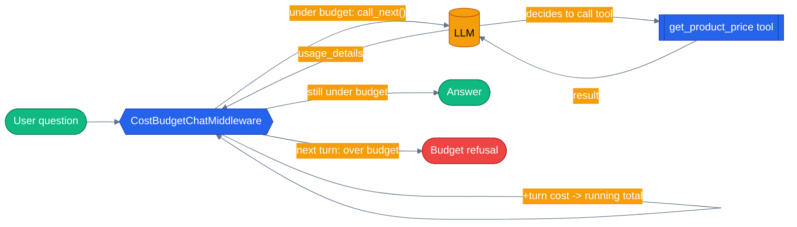

# Chapter 32 — Cost Control and Budgets

An agentic loop that keeps calling tools and re-prompting the model has no natural stopping point of its own — nothing about the loop knows it's gotten expensive. This chapter builds a small `ChatMiddleware` that tracks the running dollar cost of a run turn by turn and, once it crosses a ceiling, refuses to start another one — the same mechanic the capstone app's `CostBudgetMiddleware` uses in production.

## Why this chapter

[Chapter 07](../07-observability-otel/) and [`docs/concepts/13-observability-and-cost.md`](../../docs/concepts/13-observability-and-cost.md) cover cost as a *reporting* concern: turn token counts into a dollar figure so an eval report or a mode-comparison UI can say what a request cost, after the fact. That's necessary but it isn't a ceiling — a report only tells you what already happened. Nothing stops a tool-calling loop from re-prompting the model ten more times on a single user request if the model keeps deciding it needs one more lookup; by the time a post-hoc report shows the number, the money is already spent. In this repo, `shared/cost.py::estimate_cost()` existed for exactly one caller for a long time — `evals/evaluator.py`, pricing a *completed* eval run — and nothing at runtime ever read it. That gap, not the pricing math itself, is what this chapter's middleware closes: the same `estimate_cost()` formula, called on every turn *as the run happens*, with a hard stop available if you want one.

## Prerequisites

- Completed [Chapter 06 — Middleware and the Agent Pipeline](../06-middleware/) — this chapter assumes you already know the three middleware kinds and how `call_next()` works
- Repo-root `.env` with a working LLM provider (`OPENAI_API_KEY`, or `AZURE_OPENAI_ENDPOINT` + `AZURE_OPENAI_KEY` + `AZURE_OPENAI_DEPLOYMENT`)
- Skim [`docs/concepts/13-observability-and-cost.md`](../../docs/concepts/13-observability-and-cost.md) for the tokens-as-cost-unit background — this chapter doesn't re-derive that, it builds the runtime enforcement on top of it

## The concept

A cost *ceiling* and a cost *report* answer different questions at different times. A report answers "what did this cost?" once the run is already over — useful for an eval dashboard, useless for stopping a runaway request while it's still spending. A ceiling answers "should the next turn even happen?" — it has to run *inside* the loop, checking the running total before every model call, not after the whole thing finishes. That's why this has to be middleware and not a wrapper around the final response: `ChatMiddleware.process()` fires once per raw LLM call, which for a tool-calling agent means multiple times per user question — exactly the granularity a budget check needs.

This repo already has a two-tier posture for a guardrail that can misfire: `GROUNDING_MODE` (`docs/concepts/10-guardrails.md`) can `observe` (log only) or `enforce` (change behavior) without an all-or-nothing flag. The cost budget uses the identical shape — `COST_BUDGET_MODE` is `"off"` (middleware not attached at all), `"observe"` (accumulate and log every turn's cost; never block, even past the ceiling), or `"enforce"` (same accumulation, plus refuse the next turn once the running total exceeds the ceiling). `observe` is the safe default specifically because it can't change a run's outcome, only its logs — you can turn cost tracking on in production and watch real numbers accumulate for a while before ever risking a false-positive refusal on a legitimate expensive request. Both `COST_BUDGET_MODE` (default `"observe"`) and `COST_BUDGET_USD_PER_RUN` (default `None`, i.e. unset) ship additive and opt-in in this repo, matching every other guardrail flag's default-off posture — nothing is enforced anywhere until an operator sets both.

The enforcement mechanic itself has an honest limitation worth stating up front: cost is only knowable *after* a turn completes, from its usage data — there's no way to know a turn's price before making it. So `enforce` mode is necessarily one turn behind the actual overage: it can't abort a call already in flight, it can only refuse the *next* one once the running total from completed turns has already crossed the line. A run can therefore finish slightly over budget (whatever the last permitted turn cost), never wildly over it. That's the same trade-off the real `GroundingVerificationMiddleware` accepts for streamed content — correct the next decision point, not the one already committed.



The middleware sits *between* every model call and the model itself — it can let a turn through, price it after the fact, and refuse the next one without the agent's own code ever knowing a budget exists.

## Python

Run from the repo root using the shared `tutorials/` uv project (one `uv sync` covers every chapter):

```bash
uv sync --project tutorials
uv run --project tutorials python tutorials/32-cost-control-and-budgets/python/main.py
```

Source: [`python/main.py`](./python/main.py). The middleware itself:

```python
class CostBudgetChatMiddleware(ChatMiddleware):
    def __init__(self, *, budget_usd: float, mode: str = "enforce") -> None:
        self.budget_usd = budget_usd
        self.mode = mode
        self.total_cost_usd = 0.0
        self.turns_recorded = 0
        self.blocked = 0

    async def process(self, context: ChatContext, call_next: Callable[[], Awaitable[None]]) -> None:
        if self.mode == "off":
            await call_next()
            return

        if self.mode == "enforce" and self.total_cost_usd > self.budget_usd:
            self.blocked += 1
            context.result = ChatResponse(
                messages=[Message(role="assistant", contents=[BUDGET_REFUSAL_MESSAGE])],
                finish_reason="length",
            )
            return  # short-circuit — call_next() is never invoked

        await call_next()
        if context.result is None:
            return
        self._record(context.result)
```

`_record()` reads `context.result.usage_details` (the same attribute the real client populates from the provider's response), converts token counts to a dollar figure with a simplified, single-model version of `estimate_cost()`, and adds it to `self.total_cost_usd`. The check-before-`call_next()` / record-after-`call_next()` split is the whole mechanism — everything else in the class is bookkeeping for the demo's printouts.

`build_agent()` wires the tool and the middleware exactly the way Chapter 06 wires its three middleware classes:

```python
def build_agent(budget_middleware: CostBudgetChatMiddleware, client: object | None = None) -> Agent:
    return Agent(
        client or _default_client(),
        instructions=INSTRUCTIONS,
        name="cost-budget-agent",
        tools=[get_product_price],
        middleware=[budget_middleware],
    )
```

`main()` asks three questions in sequence against the *same* middleware instance, so cost accumulates across them the way it would across a longer real run — a single tool-calling question is only two model turns, not enough to demonstrate a ceiling tripping on its own. `DEMO_BUDGET_USD_PER_RUN` is set to a fraction of a cent purely so the ceiling trips within those three short questions; a real deployment sets `COST_BUDGET_USD_PER_RUN` for its actual workload economics, not a teaching demo's scale. A real run against Azure OpenAI looks like this:

```text
budget: $0.0015 per run (mode=enforce)

  [budget] turn 1: +$0.0004 (in=120 out=19) -> running total $0.0004
  [budget] turn 2: +$0.0004 (in=151 out=15) -> running total $0.0008
Q: What's the price of product P-100?
A: The price of product P-100 is $129.99.

  [budget] turn 3: +$0.0004 (in=120 out=19) -> running total $0.0012
  [budget] turn 4: +$0.0004 (in=151 out=15) -> running total $0.0016
Q: What's the price of product P-200?
A: The price of product P-200 is $49.50.

  [budget] refused turn 5 — running total $0.0016 already exceeds $0.0015
Q: What's the price of product P-300?
A: This run has been stopped because it exceeded its configured cost budget. Start a new request, or raise the budget if this ceiling is too low.

turns recorded: 4
turns blocked:  1
running total:  $0.0016 (budget $0.0015)
```

The first two questions each cost two turns (tool call, then answer) and both complete normally. By the third question the running total ($0.0016) already exceeds the budget ($0.0015) from the second question's turns — so the third question's very first turn is refused before it's made, and the agent's "answer" is the canned refusal text instead of a real price lookup.

## .NET

Source: [`dotnet/Program.cs`](./dotnet/Program.cs).

```bash
cd tutorials/32-cost-control-and-budgets/dotnet
dotnet run
dotnet test tests/CostControl.Tests.csproj
```

**This is the chapter where .NET can test what Python cannot.** Python's `ReplayChatClient` composes `FunctionInvocationLayer` directly and skips `ChatMiddlewareLayer`, so `CostBudgetChatMiddleware.process()` never runs under `LLM_PROVIDER=replay` and the enforcement path is live-LLM-only. A `DelegatingChatClient` has no such gap — it wraps whatever it is handed — so all of it is gated on every PR, for free.

```csharp
IChatClient pipeline = inner
    .AsBuilder()
    .Use(next => new CostBudgetChatClient(next, budget, log))
    .Build();
```

Order matters: the budget client sits **outside** function invocation, so each model round trip in a tool-calling loop is one budgeted turn. `A_Tool_Calling_Loop_Costs_One_Budgeted_Turn_Per_Model_Round_Trip` asserts it — if a two-turn tool call only counted once, an agent looping through ten tool calls would look as cheap as one.

### Two behaviours that read like bugs

- **Enforcement is one turn behind.** Cost is only knowable *after* a turn completes, from its `Usage`, so the turn that crosses the ceiling always runs to completion and the one after it is refused. A budget promising a hard cap would be lying. `The_Turn_That_Crosses_The_Ceiling_Still_Completes` asserts the honest version.
- **A refusal is a response, not an exception**, with `FinishReason.Length` — so a caller cannot forget to handle it, and does not have to.

Streaming needs its own path: usage arrives as a `UsageContent` item on the stream rather than on a response object, and missing it gives a streaming agent a budget that never accumulates and therefore never trips.

A provider that omits usage entirely gets its own counter (`TurnsUnpriced`) rather than being treated as free — silently disabling the budget is how a run goes unbounded without anything looking wrong.

## Gotchas

- **`enforce` checks *before* `call_next()`, records *after* it.** Reversing that — checking after recording the current turn's own cost — would mean a turn could push the total over budget and still complete; the ceiling only ever blocks the *next* turn, never the one currently running. This is deliberate, not a bug: see "The concept" above.
- **`ChatMiddleware` doesn't fire under `LLM_PROVIDER=replay`.** `tutorials/_shared/replay_client.py`'s `ReplayChatClient` composes `FunctionInvocationLayer` directly with `BaseChatClient`, skipping `ChatMiddlewareLayer` entirely (see that module's own docstring) — a replay client doesn't need it just to play back a tool call correctly. That means the budget middleware's turn-by-turn prints and its refusal are only observable against a live LLM; the replay test in this chapter only proves the tool-calling round trip replays correctly. Chapter 06's PII-redaction `ChatMiddleware` has the identical limitation, for the identical reason.
- **A budget of `0.0` still allows exactly one turn.** The check is `total_cost_usd > budget_usd`, not `>=` — before anything has been spent, `0.0 > 0.0` is `False`, so the very first turn always goes through even at a zero budget. This mirrors production's `CostBudgetMiddleware` exactly and is covered by a unit test.
- **This demo uses a plain instance attribute, not a `ContextVar`.** Production's `CostBudgetMiddleware` accumulates into `current_run_cost_usd`, a `ContextVar`, because concurrent requests in the real app run as separate asyncio Tasks that must never see each other's running total. This chapter's questions run sequentially in one process, so a plain attribute is enough — don't copy that simplification into code that serves concurrent requests.
- **Missing `usage_details` is silently skipped, not priced at zero.** A response without usage data (some fixtures, some providers) means `_record()` returns without adding anything — this is a "no data" case, not a "free call," matching production's `_turn_cost()`.

## Tests

```bash
uv run --project tutorials pytest tutorials/32-cost-control-and-budgets/python/tests -v
```

`tutorials/32-cost-control-and-budgets/python/tests/test_cost_control_and_budgets.py` covers, structurally:

1. **Unit tests against the tool function directly** — canned price for a known product ID, a clean fallback for an unknown one, case-insensitivity — no LLM involved.
2. **Agent wiring** — `get_product_price` and the `CostBudgetChatMiddleware` instance both show up on `build_agent()`'s built agent.
3. **Middleware unit tests against a hand-built duck-typed `ChatContext`** — cost accumulates across turns, `observe` mode never blocks even far over budget, `off` mode skips tracking entirely, `enforce` mode lets the first two turns through (running total `<=` budget) and refuses the third, and the zero-budget edge case above — none of these touch an LLM, mirroring the real `agents/python/tests/test_cost_budget.py` test names and structure.
4. **A replay test** (`test_replay_invokes_price_tool_and_answers`) that plays back a committed fixture in `tests/fixtures/replay/` — no network or credentials required, safe for CI. Per the Gotchas above, it only asserts the tool-calling answer, not middleware counters.
5. **Real-LLM integration tests**, skipped unless usable credentials are present — one drives the three-question demo end to end and asserts the budget actually trips (`blocked >= 1`), the other asserts `observe` mode never blocks no matter how far over a trivially tiny budget it goes.

## How this shows up in the capstone

This chapter's `CostBudgetChatMiddleware` is a simplified stand-in for `CostBudgetMiddleware` in `agents/python/shared/guardrails/cost_budget_middleware.py:119`, whose own `process()` method (`agents/python/shared/guardrails/cost_budget_middleware.py:132`) is the exact check-before / record-after pattern this chapter teaches — same short-circuit shape as `InjectionDetectionChatMiddleware`, per that file's own module docstring. The one structural difference is the accumulator: production reads and writes `current_run_cost_usd`, a `ContextVar` (`agents/python/shared/guardrails/cost_budget_middleware.py:69`), instead of this chapter's plain instance attribute, specifically so concurrent requests (separate asyncio Tasks in the real app) never see each other's running total.

It's wired into the standard middleware stack at the single composition point every specialist and the orchestrator use, `build_specialist_middleware()` in `agents/python/shared/middleware.py:179`, gated on the mode flag:

```python
if settings.COST_BUDGET_MODE != "off":
    stack.append(CostBudgetMiddleware())
```

(`agents/python/shared/middleware.py:224-225`.) Both config flags live in `agents/python/shared/config.py`: `COST_BUDGET_MODE: str = "observe"` at `agents/python/shared/config.py:295`, and `COST_BUDGET_USD_PER_RUN: float | None = None` at `agents/python/shared/config.py:300` — off by default, opt-in, exactly as this chapter's "The concept" section describes.

The per-turn dollar conversion itself — token counts to USD — is `estimate_cost()` in `agents/python/shared/cost.py:45`, the same function this chapter's `estimate_cost_usd()` simplifies down to a single model's pricing. Before `CostBudgetMiddleware` existed, that function had exactly one caller (`evals/evaluator.py`, pricing a *completed* eval run for reporting); the middleware is what turns it into a runtime ceiling instead of an after-the-fact number. `agents/python/tests/test_cost_budget.py` (266 lines) is the real test suite this chapter's own middleware tests deliberately mirror the shape of.

## What's next

- Previous chapter: [Chapter 31 — Retry and Compensation](../31-retry-and-compensation/)
- Full source: [`python/`](./python/)
- Concept deep dive: [`docs/concepts/13-observability-and-cost.md`](../../docs/concepts/13-observability-and-cost.md)
- Shared: [Mermaid style guide](../_shared/mermaid-style-guide.md) · [Jargon glossary](../_shared/jargon-glossary.md)
