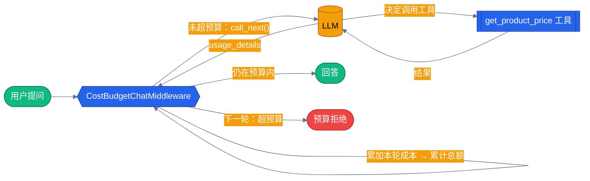

# 第 32 章 · 成本控制与预算

[项目首页](../../README.md) · [教程总览](../README.md) · [术语表](../_shared/jargon-glossary.md)

一个不断调用工具、反复重新提示模型的智能体循环，自身没有任何天然的停止点 —— 循环里没有任何东西知道自己已经变贵了。本章构建一个小型 `ChatMiddleware`，逐轮跟踪一次运行的美元成本，并在越过上限后拒绝再开始下一轮 —— 这正是完整项目的 `CostBudgetMiddleware` 在生产中所用的同一套机制。

## 本章动机

[第 07 章](../07-observability-otel/)与 [`docs/concepts/13-observability-and-cost.md`](../../docs/concepts/13-observability-and-cost.md) 把成本作为*报告*问题来讲：把每轮的 token 数换算成美元，好让一份评测报告或模式对比界面在事后说出一次请求花了多少钱。这很必要，但它不是一个上限 —— 报告只能告诉你已经发生了什么。没有任何东西阻止一个工具调用循环在单个用户请求上把模型再重新提示十次，只要模型一直认为自己还需要再查一次；等到事后报告显示出那个数字时，钱已经花掉了。在本仓库中，`shared/cost.py::estimate_cost()` 在很长一段时间里只有一个调用方 —— `evals/evaluator.py`，给一次*已完成的*评测运行定价 —— 运行期从来没有任何东西读过它。本章中间件要补上的正是这个缺口，而不是定价公式本身：同一套 `estimate_cost()` 公式，在运行过程中*每一轮*都被调用，并且在你需要时提供一个硬性停止。

## 前置条件

- 已完成[第 06 章 · 中间件与智能体管线](../06-middleware/) —— 本章假设你已经了解三类中间件以及 `call_next()` 的工作方式
- 仓库根目录的 `.env` 中有可用的 LLM 提供方（`OPENAI_API_KEY`，或 `AZURE_OPENAI_ENDPOINT` + `AZURE_OPENAI_KEY` + `AZURE_OPENAI_DEPLOYMENT`）
- 浏览 [`docs/concepts/13-observability-and-cost.md`](../../docs/concepts/13-observability-and-cost.md) 了解「以 token 为成本单位」的背景 —— 本章不重新推导它，而是在其之上构建运行期强制

## 核心概念

成本*上限*与成本*报告*在不同时刻回答不同的问题。报告回答「这次花了多少？」，在运行已经结束之后 —— 对评测看板有用，对在一个仍在花钱的失控请求中途把它拦住则毫无用处。上限回答「下一轮到底该不该发生？」—— 它必须跑在循环*内部*，在每次模型调用之前检查累计总额，而不是等整件事结束之后。这正是为什么它必须是中间件，而不是对最终响应的包装：`ChatMiddleware.process()` 每次原始 LLM 调用触发一次，对于带工具调用的智能体而言，这意味着每个用户问题会触发多次 —— 恰好是预算检查所需的粒度。

本仓库对「可能误触的护栏」已经有一套两档姿态：`GROUNDING_MODE`（`docs/concepts/10-guardrails.md`）可以是 `observe`（只记日志）或 `enforce`（改变行为），而不需要一个全有或全无的开关。成本预算使用完全相同的形态 —— `COST_BUDGET_MODE` 取 `"off"`（完全不挂载中间件）、`"observe"`（累计并记录每一轮的成本；即使越过上限也从不拦截），或 `"enforce"`（同样的累计，外加一旦累计总额超过上限就拒绝下一轮）。`observe` 之所以是安全的默认值，正是因为它无法改变一次运行的结果，只能改变它的日志 —— 你可以在生产环境打开成本跟踪、先观察真实数字累积一段时间，再去冒「对一次合法的昂贵请求产生误拒」的风险。`COST_BUDGET_MODE`（默认 `"observe"`）与 `COST_BUDGET_USD_PER_RUN`（默认 `None`，即未设置）在本仓库中都以增量、可选的方式提供，与其他每一个护栏开关默认关闭的姿态一致 —— 除非运维同时设置两者，否则任何地方都不会强制执行。

强制机制本身有一个值得事先说明的诚实局限：成本只有在一轮*完成之后*、从其用量数据中才可知 —— 没有办法在发起之前知道一轮的价格。因此 `enforce` 模式必然落后于实际超支一轮：它无法中止一次已经在途的调用，只能在已完成轮次的累计总额已经越线之后拒绝*下一*轮。于是运行结束时可能略微超出预算（即最后那个被允许的轮次的成本），但绝不会大幅超出。这与真实的 `GroundingVerificationMiddleware` 对流式内容所接受的取舍相同 —— 纠正下一个决策点，而不是已经承诺的那个。


```mermaid
%%{init: {'theme':'base', 'themeVariables': {
  'primaryColor': '#2563eb','primaryTextColor': '#ffffff','primaryBorderColor': '#1e40af',
  'lineColor': '#64748b','secondaryColor': '#f59e0b','tertiaryColor': '#10b981',
  'background': 'transparent'}}}%%
flowchart LR
  classDef core     fill:#2563eb,stroke:#1e40af,color:#ffffff
  classDef external fill:#f59e0b,stroke:#b45309,color:#000000
  classDef success  fill:#10b981,stroke:#047857,color:#ffffff
  classDef error    fill:#ef4444,stroke:#b91c1c,color:#ffffff

  user([用户提问])
  budget{{CostBudgetChatMiddleware}}
  llm[(LLM)]
  tool[[get_product_price 工具]]
  answer([回答])
  refusal([预算拒绝])

  user --> budget
  budget -- "未超预算：call_next()" --> llm
  llm -- "决定调用工具" --> tool
  tool -- "结果" --> llm
  llm -- "usage_details" --> budget
  budget -- "累加本轮成本 → 累计总额" --> budget
  budget -- "仍在预算内" --> answer
  budget -- "下一轮：超预算" --> refusal

  class user success
  class llm external
  class tool core
  class budget core
  class answer success
  class refusal error
```

中间件位于每次模型调用与模型本身*之间* —— 它可以让一轮通过、在事后为它定价、并拒绝下一轮，而智能体自己的代码始终不知道预算的存在。

## Python

在仓库根目录运行，使用共享的 `tutorials/` uv 项目（一次 `uv sync` 覆盖全部章节）：

```bash
uv sync --project tutorials
uv run --project tutorials python tutorials/32-cost-control-and-budgets/python/main.py
```

源码：[`python/main.py`](./python/main.py)。中间件本身：

```python
class CostBudgetChatMiddleware(ChatMiddleware):
    def __init__(self, *, budget_usd: float, mode: str = "enforce") -> None:
        self.budget_usd = budget_usd
        self.mode = mode
        self.total_cost_usd = 0.0
        self.turns_recorded = 0
        self.blocked = 0

    async def process(self, context: ChatContext, call_next: Callable[[], Awaitable[None]]) -> None:
        if self.mode == "off":
            await call_next()
            return

        if self.mode == "enforce" and self.total_cost_usd > self.budget_usd:
            self.blocked += 1
            context.result = ChatResponse(
                messages=[Message(role="assistant", contents=[BUDGET_REFUSAL_MESSAGE])],
                finish_reason="length",
            )
            return  # 短路 —— call_next() 永远不会被调用

        await call_next()
        if context.result is None:
            return
        self._record(context.result)
```

`_record()` 读取 `context.result.usage_details`（真实客户端从提供方响应中填充的同一个属性），用一个简化到单模型的 `estimate_cost()` 版本把 token 数换算成美元，并累加进 `self.total_cost_usd`。`call_next()` 之前检查、`call_next()` 之后记录 —— 这个分工就是全部机制；类里其余的一切都只是为演示打印服务的记账。

`build_agent()` 接工具与中间件的方式，与第 06 章接它那三个中间件类完全一致：

```python
def build_agent(budget_middleware: CostBudgetChatMiddleware, client: object | None = None) -> Agent:
    return Agent(
        client or _default_client(),
        instructions=INSTRUCTIONS,
        name="cost-budget-agent",
        tools=[get_product_price],
        middleware=[budget_middleware],
    )
```

`main()` 针对*同一个*中间件实例依次问三个问题，因此成本会像在一次更长的真实运行中那样跨问题累积 —— 单个带工具调用的问题只有两轮模型调用，不足以演示上限被触顶。`DEMO_BUDGET_USD_PER_RUN` 被设成不到一美分，纯粹是为了让上限在那三个简短问题内就被触顶；真实部署会按自己实际的工作负载经济性来设 `COST_BUDGET_USD_PER_RUN`，而不是按教学演示的量级。一次针对 Azure OpenAI 的真实运行看起来是这样的：

```text
budget: $0.0015 per run (mode=enforce)

  [budget] turn 1: +$0.0004 (in=120 out=19) -> running total $0.0004
  [budget] turn 2: +$0.0004 (in=151 out=15) -> running total $0.0008
Q: What's the price of product P-100?
A: The price of product P-100 is $129.99.

  [budget] turn 3: +$0.0004 (in=120 out=19) -> running total $0.0012
  [budget] turn 4: +$0.0004 (in=151 out=15) -> running total $0.0016
Q: What's the price of product P-200?
A: The price of product P-200 is $49.50.

  [budget] refused turn 5 — running total $0.0016 already exceeds $0.0015
Q: What's the price of product P-300?
A: This run has been stopped because it exceeded its configured cost budget. Start a new request, or raise the budget if this ceiling is too low.

turns recorded: 4
turns blocked:  1
running total:  $0.0016 (budget $0.0015)
```

前两个问题各花两轮（工具调用，然后回答），都正常完成。到第三个问题时，累计总额（$0.0016）已经因第二个问题的那几轮而超过了预算（$0.0015）—— 于是第三个问题的第一轮在发起之前就被拒绝，智能体的「回答」变成预置的拒绝文本，而不是一次真实的价格查询。

## 常见坑

- **`enforce` 在 `call_next()` *之前*检查、在它*之后*记录。** 把顺序反过来 —— 在记录完当前轮自身成本之后才检查 —— 就意味着某一轮可以把总额推过预算却仍然完成；上限永远只拦*下一*轮，从不拦当前正在跑的这一轮。这是刻意的，不是缺陷：见上文「核心概念」。
- **`ChatMiddleware` 在 `LLM_PROVIDER=replay` 下不会触发。** `tutorials/_shared/replay_client.py` 的 `ReplayChatClient` 把 `FunctionInvocationLayer` 与 `BaseChatClient` 直接组合，完全跳过了 `ChatMiddlewareLayer`（见该模块自己的 docstring）—— 一个回放客户端仅仅为了正确回放一次工具调用并不需要它。这意味着预算中间件的逐轮打印与它的拒绝，只有面对真实 LLM 时才可观察；本章的回放测试只证明工具调用往返能正确回放。第 06 章做 PII 脱敏的 `ChatMiddleware` 出于同样的原因、有完全相同的局限。
- **预算为 `0.0` 时仍然恰好允许一轮。** 判断是 `total_cost_usd > budget_usd` 而不是 `>=` —— 在还没花任何钱时，`0.0 > 0.0` 为 `False`，因此即使预算是零，第一轮也总会通过。这与生产实现的 `CostBudgetMiddleware` 完全一致，并有单元测试覆盖。
- **拒绝是一个响应，而不是异常。** 它带 `finish_reason="length"` 返回，因此调用方不可能忘记处理它，也不需要处理它。
- **流式需要自己的路径。** 用量在流上是作为 `UsageContent` 项到达的，而不是挂在响应对象上；漏掉它就会让一个流式智能体得到一个永不累积、因而永不触顶的预算。
- **完全省略用量的提供方需要自己的计数器。** 生产实现为这种情况单独计数（`TurnsUnpriced`），而不是把它当作免费 —— 静默地让预算失效，正是让一次运行变得无界而表面上一切正常的方式。本章的 `_record()` 遇到缺失用量时只是跳过不加，属于「无数据」而非「免费调用」，与生产实现的 `_turn_cost()` 一致。
- **本演示用的是普通实例属性，而不是 `ContextVar`。** 生产实现的 `CostBudgetMiddleware` 把成本累加进 `current_run_cost_usd`，一个 `ContextVar`，因为真实应用中的并发请求是各自独立的 asyncio Task，绝不能看到彼此的累计总额。本章的问题在一个进程里顺序执行，因此普通属性就够 —— 不要把这种简化照搬进服务并发请求的代码。

## 测试

```bash
uv run --project tutorials pytest tutorials/32-cost-control-and-budgets/python/tests -v
```

`tutorials/32-cost-control-and-budgets/python/tests/test_cost_control_and_budgets.py` 从结构上覆盖：

1. **直接针对工具函数的单元测试** —— 已知商品 ID 的预置价格、未知商品 ID 的干净兜底、大小写不敏感 —— 不涉及 LLM。
2. **智能体接线** —— `get_product_price` 与那个 `CostBudgetChatMiddleware` 实例都出现在 `build_agent()` 构建出的智能体上。
3. **针对手工构造的鸭子类型 `ChatContext` 的中间件单元测试** —— 成本跨轮累积；`observe` 模式即使远超预算也从不拦截；`off` 模式完全跳过跟踪；`enforce` 模式让前两轮通过（累计总额 `<=` 预算）并拒绝第三轮；以及上面那个零预算的边界情况 —— 以上都不接触 LLM，其测试名称与结构都刻意对齐真实的 `agents/python/tests/test_cost_budget.py`。
4. **一次回放测试**（`test_replay_invokes_price_tool_and_answers`），播放 `tests/fixtures/replay/` 中已提交的夹具 —— 不需要网络或凭据，可安全用于 CI。按上文「常见坑」所述，它只断言工具调用的回答，不断言中间件计数器。
5. **真实 LLM 集成测试**，在缺少可用凭据时跳过 —— 一个端到端驱动那个三问演示并断言预算确实被触顶（`blocked >= 1`），另一个断言 `observe` 模式无论超出多么微小的预算多远都从不拦截。

## 在完整项目中的落点

本章的 `CostBudgetChatMiddleware` 是 `agents/python/shared/guardrails/cost_budget_middleware.py:83` 中 `CostBudgetMiddleware` 的简化替身，其 `process()` 方法（`agents/python/shared/guardrails/cost_budget_middleware.py:94`）正是本章讲授的「先检查 / 后记录」模式 —— 与 `InjectionDetectionChatMiddleware` 相同的短路形态，这一点在该文件自己的模块 docstring 中有说明。唯一的结构性差别是累加器：生产实现读写 `current_run_cost_usd`，一个 `ContextVar`（`agents/python/shared/guardrails/cost_budget_middleware.py:29`），而不是本章的普通实例属性 —— 专门为了让并发请求（真实应用中各自独立的 asyncio Task）绝不看到彼此的累计总额。

它接在标准中间件栈上那个每个专业智能体与编排器都使用的唯一组装点 —— `agents/python/shared/middleware.py:214` 的 `build_specialist_middleware()` —— 并由模式开关门控：

```python
if settings.COST_BUDGET_MODE != "off":
    stack.append(CostBudgetMiddleware())
```

（`agents/python/shared/middleware.py:248-245`。）两个配置开关都位于 `agents/python/shared/config.py`：`COST_BUDGET_MODE: str = "observe"` 在 `agents/python/shared/config.py:341`，`COST_BUDGET_USD_PER_RUN: float | None = None` 在 `agents/python/shared/config.py:346` —— 默认关闭、可选启用，正如本章「核心概念」小节所述。

逐轮把 token 数换算成美元这件事本身 —— 即 `agents/python/shared/cost.py:35` 的 `estimate_cost()` —— 与本章 `estimate_cost_usd()` 所简化成的单模型定价是同一个函数。在 `CostBudgetMiddleware` 存在之前，那个函数只有一个调用方（`evals/evaluator.py`，为报告给一次*已完成的*评测运行定价）；正是这个中间件把它从一个事后数字变成了运行期上限。`agents/python/tests/test_cost_budget.py`（347 行）是本章自己的中间件测试刻意对齐其形态的真实测试套件。

## 下一步

- 上一章：[第 31 章 · 重试与补偿](../31-retry-and-compensation/)
- 完整源码：[`python/`](./python/)
- 概念深入：[`docs/concepts/13-observability-and-cost.md`](../../docs/concepts/13-observability-and-cost.md)
- 共享资料：[Mermaid 风格指南](../_shared/mermaid-style-guide.md) · [术语表](../_shared/jargon-glossary.md)
